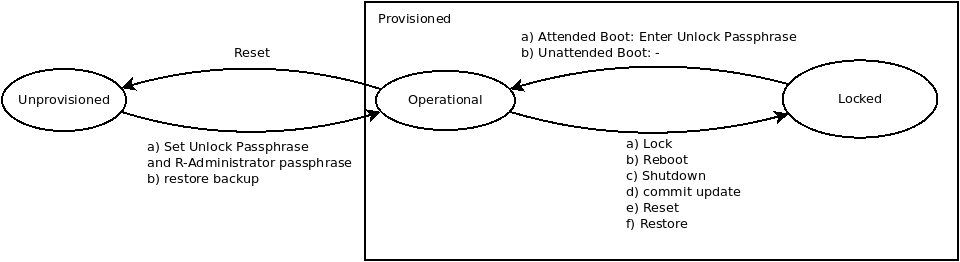
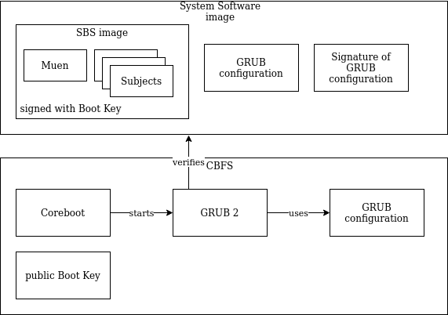

% NetHSM System Design
% Hannes Mehnert; Martin Lucina; Stefanie Schirmer; Sven Anderson; Jan Suhr
% Nitrokey GmbH, 2023

# Introduction {#sec-i}

NetHSM is a networked hardware security module which can securely store a large number of cryptographic keys, have a high computing performance, and offers common key management functions via a modern REST-based API.

This document describes the System Design and Technical Architecture of the NetHSM, which includes:

* core functionality (business logic),
* encryption architecture and local persistent storage,
* integration with Muen separation kernel, including any customizations for board support and implementation of missing functionality required for the system,
* development of a minimized Linux for Linux-based Subjects,
* integration with platform _Firmware_ (Coreboot),
* secure software updates.

A separate document describes the REST-based API for consumers.

The [Muen separation kernel][muen] is an open source microkernel that has been formally proven to contain no runtime errors at the source code level. Muen runs on the Intel x86-64 architecture, and uses the VT-x and VT-d features to provide isolation for multiple subjects. Muen-based systems are entirely static and configured only at build time.

We use Muen as the lowest layer, i.e. operating system that runs on the NetHSM hardware.

[MirageOS][mirage] is a library operating system that constructs unikernels for secure applications. Applications can be developed on a normal OS such as Linux or macOS and then retargeted to run as a unikernel on Muen without any modifications to the source code.

[muen]: https://muen.sk/
[mirage]: https://mirage.io/

# Terminology and Conventions {#sec-tac}

Authentication Store

: A data store containing encrypted user credentials (login, passphrase) and mapping to permissions/roles.

Backup Key

: A symmetric key used for outer layer encryption of system backups. Derived from the _Backup Passphrase_ once configured, and stored in the _Configuration Store_.

Backup Passphrase

: The _Backup Passphrase_ is required to gain access to a system backup.

Configuration Store

: An unencrypted data store containing system configuration, including: network configuration, TLS endpoint configuration (certificates and private key), logging and metrics configuration.

Device Key

: A persistent device-dependent key, unique to each NetHSM hardware unit delivered by Nitrokey. The *Device Key* is used to derive an _Unlock Key_.

Domain Key

: A cryptographic key used to encrypt data in the _Authentication Store_ and _Key Store_.

Domain Key Store

: A data store containing encrypted _Domain Keys_.

Extension

: An optional feature not in scope of the current implementation. Extensions are referred to as **Ext-Name** throughout this document.

Firmware

: The platform firmware (a.k.a. "BIOS", "UEFI") used by the NetHSM hardware. Refer to [System Firmware](#sec-dd-ta-sf) for details.

Key Store

: A data store containing encrypted assets (keys).

Role

: Each user account configured on the NetHSM has a single _Role_ assigned to it. Roles are referred to as **R-Name** throughout this document; see [Roles](#sec-dd-r) for a detailed list.

System Software

: The NetHSM system software, i.e. Muen and all subjects without the _Firmware_.

Tags

: Key access can be restricted to users matching specific _Tags_. Refer to [Tags](#sec-dd-t) for details.

Unlock Key

: An _Unlock Key_ is an ephemeral key required to decrypt the _Domain Key_, gaining access to the encrypted _Authentication Store_ and _Key Store_.

Unlock Passphrase

: The _Unlock Passphrase_ is used to derive an _Unlock Key_ and must be provided by the user at boot time, unless unattended boot has been configured.

User Data

: Used collectively to refer to all user data persistently stored on the NetHSM, i.e. the _Domain Key Store_, _Configuration Store_, _Authentication Store_ and _Key Store_. See [Data Model](#sec-dd-dm) for details.

Verified Boot

: The process used by the _Firmware_ to ensure that only _System Software_ cryptographically signed with a trusted key can be booted on the NetHSM hardware. See [Verified Boot](#sec-dd-ta-sf-vb) for details.

# States {#sec-s}

{width=100%}

Locked

: A _Provisioned_ NetHSM initially boots up in a _Locked_ state, with no access to the encrypted _Authentication Store_ or _Key Store_. See [Encryption Architecture](#sec-dd-ea) for details of how a _Locked_ NetHSM can transition into an _Operational_ state.

Operational

: An _Operational_ NetHSM is ready to process requests, and all functionality is available. This implies that in this state the system is neither _Locked_ nor _Unprovisioned_.

Provisioned

: The opposite of _Unprovisioned_.

Unprovisioned

: An _Unprovisioned_ NetHSM has not been configured by the user and does not contain any _User Data_, i.e. all data stores are empty or non-existent. This implies that only the limited subset of functionality needed for [Initial Provisioning](#sec-us-ip) is available.

Note: Other than a NetHSM hardware appliance, resetting a NetHSM testing software container yields to the Locked state.

# User Stories {#sec-us}

The user stories in this section are described from the point of view of a user interacting with a NetHSM.

Unless otherwise stated, an implicit pre-condition for all user stories is a NetHSM in the _Operational_ state.

Note that this list of user stories is not exhaustive.

## Initial Provisioning {#sec-us-ip}

Pre-conditions: An _Unprovisioned_ NetHSM, with its Ethernet port _directly_ connected to the client computer to be used for Initial Provisioning.

1. Power on the NetHSM.
2. The NetHSM will boot up with a static IP address of `192.168.1.1` and will generate a new self-signed TLS certificate and private key.
3. On the client computer use a client tool (such as nitropy) or access the API directly at `https://(NetHSM's hostname)/api/` to provision the NetHSM. This includes setting NetHSM's system time, an _Unlock Passphrase_, and a passphrase for an initial **R-Administrator** user account, by convention named `admin`. The NetHSM is now in an _Operational_ state.
7. Or:

     a. Restore from an existing backup. You will need to provide the _Backup Passphrase_.
     b. The NetHSM will restore all _User Data_ and reboot.
     c. Depending on the restored configuration and hardware unit, the NetHSM now continues with either [Attended Boot](#sec-us-ab) or [Unattended Boot](#sec-us-ub). Refer to [Encryption Architecture](#sec-dd-ea) and [Backup and Restore](#sec-dd-ta-s-bar) for details.

**Notes:**

After step 3, the user is expected to continue with configuration of the NetHSM, primarily by configuring the TLS endpoint by generating a CSR on the NetHSM and submitting the result to a certification authority.

In step 4a, the system will restore all _User Data_. This may result in the IP address and TLS certificate changing on next boot. Refer to [Backup and Restore](#sec-dd-ta-s-bar) for details.

## Attended Boot {#sec-us-ab}

Pre-conditions: A _Provisioned_ NetHSM, connected to your infrastructure network.

1. Power on.
2. The NetHSM boots up into the _Locked_ state. To unlock it, perform the following steps:

     a. Use a client tool (e.g. nitropy) or access the API directly at `https://(NetHSM's hostname)/api/`.
     b. Enter the _Unlock Passphrase_.
3. The NetHSM is now in an _Operational_ state.

**Notes:**

No other operations are possible when the NetHSM is in the _Locked_ state.

## Unattended Boot {#sec-us-ub}

Pre-conditions: A _Provisioned_ NetHSM, connected to your infrastructure network, with unattended boot enabled.

1. Power on.
2. The NetHSM boots up into the _Locked_ state.
3. The NetHSM will automatically transition into an _Operational_ state with no user intervention.

**Notes:**

Refer to [Encryption Architecture](#sec-dd-ea) for implementation details of unattended boot.

## Enabling Unattended Boot {#sec-us-eub}

Pre-conditions: A _Provisioned_ NetHSM, connected to your infrastructure network.

1. As a user with a **R-Administrator** role, use a client tool (e.g. nitropy) or access the API directly at `https://(NetHSM's hostname)/api/` to enable unattended boot.
2. On next boot, the NetHSM will behave as described in [Unattended Boot](#sec-us-ub).

**Notes:**

Refer to [Encryption Architecture](#sec-dd-ea) for implementation details of unattended boot.

## Disabling Unattended Boot {#sec-us-dub}

Pre-conditions: A _Provisioned_ NetHSM, connected to your infrastructure network, with unattended boot enabled.

1. As a user with a **R-Administrator** role, use a client tool (e.g. nitropy) or access the API directly at `https://(NetHSM's hostname)/api/` to disable unattended boot.
3. On next boot, the NetHSM will behave as described in [Attended Boot](#sec-us-ab).

**Notes:**

Refer to [Encryption Architecture](#sec-dd-ea) for implementation details of unattended boot.

## System Software Update {#sec-us-ssu}

Pre-conditions: A _Provisioned_ NetHSM, connected to your infrastructure network.

1. As a user with a **R-Administrator** role, use a client tool (e.g. nitropy) or access the API directly at `https://(NetHSM's hostname)/api/` to upload a signed _System Software_ image to the NetHSM.
2. The NetHSM verifies image authenticity, integrity, and version number.
3. Optionally, the NetHSM displays release notes, if any.
4. Confirm the update operation ("commit").
5. The NetHSM will reboot into the new _System Software_.

**Notes:**

Any data migration is only performed _after_ the NetHSM has successfully booted the new _System Software_ version.

If the NetHSM is powered down before the "commit" operation, the user will have to re-apply the update.

## System Backup {#sec-us-sb}

Pre-conditions: A _Provisioned_ NetHSM, connected to your infrastructure network. The _Backup Passphrase_ is configured.

1. As a user with a **R-Administrator** or **R-Backup** role, use a client tool (e.g. nitropy) or access the API directly at `https://(NetHSM's hostname)/api/` to download an encrypted backup.

**Notes:**

The backup is encrypted with the _Backup Key_, derived from the _Backup Passphrase_ when configured. Refer to [Backup and Restore](#sec-dd-ta-s-bar) for details.

## System Restore {#sec-us-sr}

### Unprovisioned {#sec-us-sr-u}

Refer to [Reset to Factory Defaults](#sec-us-rtfd) and [Initial Provisioning](#sec-us-ip).

### Operational {#sec-us-sr-p}

Pre-conditions: A _Provisioned_ NetHSM, connected to your infrastructure network.

1. As a user with a **R-Administrator** role, use a client tool (e.g. nitropy) or access the API directly at `https://(NetHSM's hostname)/api/` to restore an existing backup to the NetHSM. This requires to provide the _Backup Passphrase_ and the backup archive file.
2. The NetHSM restores keys and users data.
3. The NetHSM ends in Operational state.

**Notes:**

- Keys and users that are not present in the backup will be deleted.
- System configuration is not restored.

## Reset to Factory Defaults {#sec-us-rtfd}

### Administrative Reset {#sec-us-rtfd-ar}

Pre-conditions: A _Provisioned_ NetHSM, connected to your infrastructure network.

1. As a user with a **R-Administrator** role, use a client tool (e.g. nitropy) or access the API directly at `https://(NetHSM's hostname)/api/` to reset to Factory Defaults.
2. The NetHSM securely erases all _User Data_.
3. The NetHSM reboots.
4. The NetHSM boots up in an _Unprovisioned_ state; see [Initial Provisioning](#sec-us-ip).

# Detailed Description {#sec-dd}

## Data Model {#sec-dd-dm}

{width=75%}

All _User Data_ is stored in a number of persistent data stores on the NetHSM; see Figure 1: Data Model. Each data store is a Key/Value store, additionally containing a version number (denoted as "Store Version" in the diagram). This version number is incremented whenever the underlying data model ("Values") of a data store changes. It determines if data migration code needs to be run for that data store.

For each data store, the diagram shows, as a high-level overview, which types of "Keys" are associated with which types of "Values". See the REST API documentation for a detailed definition of the data types, including:

* valid input and output data types for each HTTPS endpoint, which correspond to the "Values" stored in each data store,
* constraints for each data type, e.g. "a KeyID needs to be a string of alphanumeric characters, which is between 1 and 128 characters long".

## Roles {#sec-dd-r}

Each user account configured on the NetHSM has _one_ of the following _Roles_ assigned to it. Following is a high-level description of the operations allowed by individual _Roles_, for endpoint-specific details please refer to the REST API documentation.

R-Administrator

: A user account with this _Role_ has access to all operations provided by the REST API, with the exception of "key usage" operations, i.e. message signing and decryption.

R-Operator

: A user account with this _Role_ has access to all "key usage" operations, a read-only subset of "key management" operations and "user management" operations allowing changes to their own account only.

R-Metrics

: A user account with this _Role_ has access to read-only metrics operations only.

R-Backup

: A user account with this _Role_ has access to the operations required to initiate a system backup only.

## Tags {#sec-dd-t}

To enable a fine-grained access control of key usage operations, Operator user accounts can get assigned a list of _Tags_ granting them access to restricted keys.

_Tags_ are managed by R-Administrator users:

- Keys can be subject to a restriction list: a set of _Tags_ in which **one** of them need to be matched for the key to be used.
- Operator users get assigned a set of _Tags_ enabling them the use of the corresponding keys. It can be read but not modified by the user.

## Encryption Architecture {#sec-dd-ea}

{width=75%}

The _Authentication Store_ and _Key Store_ are persisted to disk and their _contents_ are encrypted and authenticated using the so-called _Domain Key_. Only the **S-Keyfender** subject has decrypted access to these stores. Note that, for the avoidance of doubt, _contents_ in this context refers to only the values of each key-value store, not the keys.

The _Domain Key_ is stored in the _Domain Key Store_, and encrypted using AES256-GCM (i.e. AEAD) with ephemeral _Unlock Keys_.

The _Domain Key Store_ contains two "Slots" for encrypted _Domain Keys_; which "Slot" is used depends on whether or not the NetHSM is configured for [Unattended Boot](#sec-us-ub). Specifically, a _Provisioned_ NetHSM (via **S-Keyfender**) performs the following steps during boot to transition from the initial _Locked_ state into an _Operational_ state:

|     _State_ = _Locked_
|     _Domain Key_ = Decrypt\_AES256GCM(_Device Key_, _Slot 1_)
|     IF decryption was successful: # In case of Unattended Boot
|         GOTO UNLOCKED
|     ELSE LOOP: # In case of Attended Boot
|         _Unlock Passphrase_ = Await API call to `/unlock` endpoint
|         _Unlock Key_ = SHA256(*Device Key*|KDF(_Unlock Passphrase_))
|         _Domain Key_ = Decrypt\_AES256GCM(_Unlock Key_, _Slot 0_)
|         IF decryption was successful:
|             Return _Success_ to API caller
|             GOTO UNLOCKED
|         ELSE:
|             Return _Failure_ to API caller
|
|     UNLOCKED:
|     _State_ = _Operational_

A random _Device Key_ (unique per device) is generated during the first boot of the system. The TPM is used to seal it with the Storage Root Key (SRK) and the PCR measurement of the _Firmware_. During subsequent boots the sealed _Device Key_ is unsealed with the TPM. This prevents access of unauthorized _Firmware_ to the _Device Key_.

During [Unattended Boot](#sec-us-ub), (see Figure 2: Encryption Architecture, right hand side), the _Device Key_ is used to decrypt the encrypted _Domain Key_ stored in "Slot 1". If the decryption step fails the NetHSM shall automatically fall back to [Attended Boot](#sec-us-ab).

During [Attended Boot](#sec-us-ab), (see Figure 2: Encryption Architecture, left hand side), the NetHSM waits for the user (via the `/unlock` endpoint of the REST API) to provide an _Unlock Passphrase_. The _Device Key_ is extended with the KDF of the _Unlock Passphrase_ and hashed with SHA256. The resulting hash is used as the _Unlock Key_. The _Unlock Key_ is then similarly used to decrypt the encrypted _Domain Key_ stored in "Slot 0". If the decryption step fails (due to the user providing an incorrect _Unlock Passphrase_ or invalid _Device Key_), the NetHSM shall remain in the _Locked_ state, and continue to await an _Unlock Passphrase_.

For the avoidance of doubt: The act of [Enabling Unattended Boot](#sec-us-eub) causes **S-Keyfender** to populate "Slot 1" with a _Domain Key_ encrypted with the _Device Key_. Conversely, [Disabling Unattended Boot](#sec-us-dub) causes **S-Keyfender** to erase (overwrite) the contents of "Slot 1". At no point does the NetHSM persistently store either the _Unlock Passphrase_ or an _Unlock Key_.

## Technical Architecture {#sec-dd-ta}

{width=75%}

NetHSM consists of five Muen subjects, as shown in Figure 3: Muen Subjects. Bidirectional communication channels are drawn as arrows.

The **S-Net-External** subject is a minimized Linux which bridges Ethernet frames between the physical Ethernet device, which is passed to this subject, and the virtual network interface connected to **S-Keyfender**. Apart from the Ethernet device driver only a minimal amount of Linux "userland" needs to be present in **S-Net-External**, e.g. `brctl` and `ip`, to enable bridging between the two interfaces. Specifically, there is no need for a configured IP address for this subject.

The **S-TRNG** subject is a minimized Linux which provides external entropy to **S-Keyfender**. It utilizes a TRNG, to periodically send datagrams to **S-Keyfender** containing output of the TRNG.

The **S-Storage** subject is a minimized Linux which provides persistence to **S-Keyfender** via the `git` protocol, storing the repository on virtualized block storage provided by **S-Platform**.

The **S-Platform** subject is a minimized Linux which manages _System Software_ updates of NetHSM, and provides block storage for **S-Storage**. The physical disk device (i.e. SATA controller) is passed to this subject. The **S-Platform** subject also manages the hardware platform, and provides services to update the _System Software_, securely erase all _User Data_, read the _Device Key_, and shutdown and reboot the device.

The **S-Keyfender** subject is a MirageOS Unikernel which provides a HTTPS endpoint for the REST API that handles requests directly or by delegating it to a different subject. **S-Keyfender** is the only subject with decrypted access to the _Authentication Store_ and _Key Store_. This is the only subject exposed to the public network.

**S-DBGserver** (not illustrated) has a simple input interface to query status information, print the current contents of the log buffer, trigger a system shutdown or reboot.

**S-Time** (not illustrated) enables accessing the device's real time clock.

**Note**: Currently **S-TRNG**, **S-Storage** and **S-Platform** are combined in a single subject **S-Platform**.

### S-Keyfender {#sec-dd-ta-s}

**S-Keyfender** is the core subject of NetHSM, implemented entirely in OCaml as a MirageOS unikernel. It provides a HTTPS endpoint, serving the REST API providing the core NetHSM functionality to consumers. We expect that initially there will be two consumers of the REST API:

1. The command line tool [nitropy].
2. PKCS#11 driver

Additional functionality provided by **S-Keyfender**:

* logging of system events to a remote syslog host (as defined by [RFC 3164]),
* an API endpoint for retrieving metrics (e.g. network traffic, memory usage, store usage, key operations, uptime).

For the avoidance of doubt, the following functionality is specifically _not_ provided by **S-Keyfender**:

* A DNS resolver or DHCP client. This implies that a NetHSM can only be configured to use a static IPv4 address, and that any external services (such as syslog) can likewise only be configured using an IPv4 address.

[nitropy]: https://docs.nitrokey.com/software/nitropy/
[RFC 3164]: https://tools.ietf.org/html/rfc3164

#### Timekeeping {#sec-dd-ta-s-t}

In order to provide core system functionality, including but not limited to:

1. Correct responses in HTTP headers (e.g. `Last-Modified`, `Expires`, `Date`).
2. Meaningful timestamps in log messages.

**S-Keyfender** requires access to "wall clock" time. Muen systems have a built-in time subject which has exclusive access to the RTC and provides system-wide "wall clock" time to all subjects. However, there is currently no support in Muen for _setting_ the system-wide "wall clock" and persisting it to the RTC.

Therefore, as a minimum, we will implement a REST endpoint to allow an **R-Administrator** to set the "wall clock" time as seen by **S-Keyfender**. **S-Keyfender** will persist the offset between the RTC and "wall clock" time to the _Configuration Store_, allowing **S-Keyfender** to maintain "wall clock" time across reboots. This implies that, in the mean time, other subjects such as **S-Storage**, **S-Platform** and **S-TRNG** will _not_ share the same view of "wall clock" time as **S-Keyfender**.

**Note**: There will be no support for timezones; any time values used in REST API endpoints will use Coordinated Universal Time (UTC) only, i.e. an [RFC 3339] `time-offset` of `Z`. It is the responsibility of the client (e.g. Web UI) to translate to local time, if this is desired.

[RFC 3339]: https://tool.ietf.org/html/rfc3339

#### Backup and Restore {#sec-dd-ta-s-bar}

Every backup is encrypted with a _Backup Key_, which is computed from the _Backup Passphrase_ using a key derivation function. When a _Backup Passphrase_ is configured or changed by an **R-Administrator**, the resulting _Backup Key_ is stored in the unencrypted _Configuration Store_. The backup HTTPS endpoint is only enabled after the _Backup Passphrase_ has been configured by an **R-Administrator** and a _Backup Key_ exists.

The backup is double-encrypted: the outer encryption layer uses the _Backup Key_, the data contained is the unencrypted _Configuration Store_ and the _Authentication Store_, _Domain Key Store_ and _Key Store_, all of which are encrypted with the _Domain Key_ as an inner encryption layer.

This implies that:

1. To gain access to all data contained in a backup (notably the encrypted contents of the _Authentication Store_ and _Key Store_), _both_ the _Backup Key_ and an _Unlock Key_ are required.
2. Storing the _Backup Key_ in the unencrypted _Configuration Store_ is not a security risk (does not change the threat model), as the only data additionally protected by the _Backup Key_ is that contained in the same unencrypted _Configuration Store_. An attacker that has physical access to the NetHSM can already gain access to this data.

The backup mechanism is designed this way to support automated backups: Once the _Backup Passphrase_ has been configured by an **R-Administrator**, an external client can periodically fetch the backup endpoint and store the data persistently. This backup client only requires credentials for an **R-Backup** user account, and is _not_ able to decrypt the backup, neither the outer nor the inner layer.

When a backup is initiated, **S-Keyfender** prepares a backup, encrypts it with the stored _Backup Key_ and sends it to the requesting client.

During system restore, the backup is decrypted by **S-Keyfender** using an ephemeral _Backup Key_ computed from the _Backup Passphrase_ provided by the user and, if the decryption is successful, all _User Data_ is restored. In order to be able to operate on the restored data, the NetHSM also requires an _Unlock Key_. In practice this means that either the corresponding _Unlock Passphrase_ current at the time of the backup must be known to the person restoring the backup, or the backup must have been restored on the same hardware unit which has created it, and [Unattended Boot](#sec-us-ub) must have been enabled. For details refer to [Encryption Architecture](#sec-dd-ea).

**Note (Unprovisioned)**: For the avoidance of doubt, partial backup and restore are _not_ provided when restoring from an unprovisioned state. This implies that restoring a backup may change the network and TLS endpoint configuration of the NetHSM, and also the _Unlock Passphrase_, to those current at the time of the backup.

**Note (Operational)**: When restoring from an operational state, only _Authentication Store_ and _Key Store_ are restored. Data in _Configuration Store_ and _Domain Key Store_ is ignored.

When performing backups, **S-Keyfender** serializes (but _not_ decrypts) the contents of each data store (i.e. _User Data_) into a JSON format, and encrypts the result with the _Backup Key_. This will only backup a snapshot of each data store without history. During system restore, the reverse process is performed; the contents of each data store are de-serialized from the JSON format and inserted into the store.

#### Communication with S-Platform {#sec-dd-ta-cws}

The **S-Keyfender** subject uses a communication channel with **S-Platform** to conduct operations that need low-level platform functionality: reboot, shutdown, reset, update, and retrieving the *Device Key*. The protocol is line-based over a TCP stream, where **S-Platform** is listening on a socket for client connections - only a single client connection at any time is supported.

The client, after establishing the TCP stream, sends the command (all uppercase) followed by a single newline character. The server replies with either "OK" or "ERROR", optionally followed by a whitespace character and printable ASCII characters, terminated with a newline character.

Some sample sessions:

    | C->S: DEVICE-KEY\n
    | S->C: OK abcdef\n

    | C->S: SHUTDOWN\n
    | S->C: OK\n

    | C->S: FOO\n
    | S->C: ERROR Unknown command\n

#### Future Extensions {#sec-dd-ta-fe}

**Ext-MultiCore**: **S-Keyfender** could be split up into two subjects: **S-Keyfender**, and **S-Crypto-Worker**. **S-Keyfender** would then delegate all operations on private key material (key generation, decryption, signing) to **S-Crypto-Worker**. This could be implemented using a simple "request queue", with load-balancing to multiple instances of **S-Crypto-Worker** running on multiple CPU cores. Depending on the protocol used for such delegation requests (private key in-band or not), **S-Crypto-Worker** _may_ require access to **S-Storage**. Apart from providing the ability to scale up to multiple CPU cores for performance, this would also allow **S-Keyfender** to continue to serve HTTPS requests while a long-running cryptographic operation (e.g. key generation) is in progress.

As currently designed, the private key used by **S-Keyfender** for the TLS endpoint and other data is stored unencrypted in the _Configuration Store_. This is unavoidable as otherwise there would be no way for a NetHSM to provide a TLS endpoint. We could instead store this private key in the TPM or encrypt the *Configuration Store* with the *Device Key*. This would require both a more complex, bi-directional, communication protocol between **S-Keyfender** and **S-TRNG**.

**Ext-Syslog-TLS**: Implement full syslog support as described in [RFC 5424], with support for a TLS-based transport as described in [RFC 5425]. Requires **Ext-Time** for server TLS certificate validation.

[RFC 5424]: https://tools.ietf.org/html/rfc5424
[RFC 5425]: https://tools.ietf.org/html/rfc5425

**Ext-Time**: An alternative approach which does not require persisting current "wall clock" time in **S-Keyfender** or to the RTC would be to implement a unicast SNTP client as described in [RFC 4330] and its associated configuration endpoint (IP address).

[RFC 4330]: https://tools.ietf.org/html/rfc4330

**Ext-FirmwareUpdate**: The current design allows for in-band updates of the _System Software_ only. Notably, this does _not_ include updates of CPU microcode as Muen has no support for this, instead choosing to delegate this to the _Firmware_. _Firmware_ updates are to be deployed through BMC. If in-band update of platform _Firmware_ is desired, this can be implemented as an extension which could take the form of a USB key containing a special Muen-based system with the additional software (`flashrom` et al.) required. Note that additional threats and attack surface (ability to write to the system flash) should be carefully considered in the development of such a system.

### Linux-based Subjects {#sec-dd-ta-ls}

All Linux-based Muen subjects that are integrated in the system will be built on a common base. We use the term "minimized Linux" to refer to this base, which is a collection of:

- An LTS release of the [Linux kernel][kernelorg], with Muen SK [patches][muenlinux] and a _minimal_, _hardened_, configuration applied.
- A custom, _minimal_, componentized "userland", built with:
    - [U-Root][uroot], which provides Go implementations for the bulk of the "userland" and tooling to easily build "run from initramfs" based Linux systems.
    - A custom `uinit` for U-root, implemented in Go, which manages the Linux subject's lifecycle.
- The following additional "userland" software components, all of which are cross-compiled as static binaries using a musl libc [toolchain][muslcross], and only the _required_ subset of each is installed into the initramfs:
    - etcd
    - e2fsprogs (specifically, `mke2fs`)

[kernelorg]: https://kernel.org/
[muenlinux]: https://git.codelabs.ch/?p=muen/linux.git;a=summary
[uroot]: https://github.com/u-root/u-root
[muslcross]: https://musl.cc/

### System Software Update {#sec-dd-ta-ssu}

**Note** The software update, as described in this section, is not yet implemented.

The _System Software_ is a binary image, signed and distributed by Nitrokey. The versioning schema is *major*.*minor*. In each *major* release series, upgrades and downgrades within the same *major* release are allowed ("eligible" below). The data layout will not change within a *major* release series, but may change between release *major*.x and *major*+1.y. Downgrades to an older *major* release are not allowed.

Updates must be applied manually by the R-Administrator. "OTA" updates are not supported.

The act of updating the _System Software_ is performed by **S-Platform**; when **S-Keyfender** is processing an update file from the REST API, the following actions happen in parallel:

- **S-Keyfender** performs any decompression required and streams the binary image to **S-Platform**, which writes it to an _inactive_ system partition.
- at the same time, **S-Keyfender** verifies the "outer signature" of the Update Key (protecting the integrity of the binary image, version number, release notes) and update eligibility.

_If and only if_ verification of the _System Software_'s "outer signature" and update eligibility are successful, **S-Keyfender** enables the REST API endpoint allowing the user to "commit" the software update. Only after this endpoint is requested, **S-Keyfender** will instruct **S-Platform** to perform the actions necessary (e.g. modifying the GPT or interacting with the _Firmware_) to boot from the new system partition _once_ on next boot.

During boot, the _System Software_'s "inner signature" of the Boot Key is verified by the _Firmware_ as part of _Verified Boot_. If the new _System Software_ does not boot successfully or the _Verified Boot_ verification fails, the system will automatically reboot into the old _System Software_ as a fallback.

_If and only if_ both _Verified Boot_ verification succeeds and the new _System Software_ boots successfully, the new _System Software_ will perform the actions necessary to permanently configure the system to boot into the new _System Software_ (e.g. by modifying the GPT or interacting with the _Firmware_). The new _System Software_ may now start data migration, if required.

The actual implementation details of **S-Platform** will be based on the design used by both Chromium OS and CoreOS Container Linux, and are not described in more detail in this document; please refer to the Chromium OS [Disk Format][chromium-disk] and [File System/Autoupdate][chromium-autoupdate] design documents.

[chromium-disk]: http://www.chromium.org/chromium-os/chromiumos-design-docs/disk-format
[chromium-autoupdate]: https://www.chromium.org/chromium-os/chromiumos-design-docs/filesystem-autoupdate

### System Firmware {#sec-dd-ta-sf}

Coreboot is used as the _Firmware_ of the NetHSM, with GRUB 2 as the Coreboot payload (boot loader). It provides the following functionality:

1. GPT support for [System Software Update](#sec-dd-ta-ssu).
2. Muen uses the [Signed Block Stream][sbs-spec] (SBS) protocol for _Verified Boot_. The SBS implementation from Codelabs has been integrated to GRUB 2.
3. Support for VT-d and correct bring-up of the IOMMU, required for Muen.

[sbs-spec]: https://www.codelabs.ch/download/bsbsc-spec.pdf

#### Verified Boot {#sec-dd-ta-sf-vb}

The process of ensuring that the NetHSM hardware will only boot _System Software_ that has been cryptographically signed is denoted as _Verified Boot_. This is implemented by a custom GRUB 2 payload for Coreboot, integrating support for [Signed Block Stream][sbs-spec] from Codelabs and modified to unconditionally enable signature verification of all loaded components.

Build-time tooling provides:

1. Embed a trusted public key into CBFS in the _Firmware_ image to be flashed to NetHSM hardware. This is considered the root of trust, and cannot be modified without reflashing the NetHSM hardware.
2. Sign the components of a _System Software_ image with the matching private key (referred to as an "inner signature" in [System Software Update](#sec-dd-ta-ssu)).
3. Build a signed "Live USB" system intended for use as an "installer" to install stock NetHSM hardware with an initial _System Software_ image.

Internally, a _System Software_ image consists of the following components:

1. The SBS image containing the Muen separation kernel, all subjects and their associated userland. This image is internally signed with the _Firmware_-trusted public key.
2. A GRUB configuration file.
3. A detached signature for the GRUB configuration file, signed with the _Firmware_-trusted public key.

These components are wrapped in a plain CPIO image, which is written to the system partition.

During system boot, Coreboot will launch the GRUB 2 payload, which will initially execute the commands defined by a trusted GRUB configuration embedded in CBFS. This configuration will attempt to "chain" into a correctly signed GRUB configuration file found in any _System Software_ image present on either the internal SSD or a USB key (for use by a Live USB installer, updater, or other component). If signature verification of the configuration file succeeds, then the system will proceed to boot from that device.

## Security Design {#sec-dd-sd}

NetHSM runs on commodity hardware using a minimal amount of high-assurance software to protect private keys stored in the *Key Store*. A TPM is used to secure a *Device Key*, which is used to encrypt the *Domain Key*, and prevents unauthorized modifications of the firmware.

NetHSM security design is based on software with a minimal trusted computing base (TCB): The Muen separation kernel is used for managing the physical resources of the system and isolating the subjects from each other. Device drivers for physical devices (Ethernet, USB, Storage) are provided by minimized Linux subjects, which are accessible only from the Muen subjects. The core subject is **S-Keyfender**, a MirageOS based unikernel, developed in OCaml.

In case a subject is exploited (e.g. by exploiting the Ethernet driver of the **S-Net-External** subject), it does not lead to a compromise of the *Key Store* assets. Muen ensures that only the **S-Keyfender** subject, if it is _Unlocked_, has access to the decrypted _Key Store_. The _Domain Key_ used for encrypting data in the _Key Store_ is only kept in memory, and never written unencrypted to persistent storage.

Each subject has only the minimum of privileges absolutely necessary for its operation. The TCB is kept small. It consists of the Muen separation kernel and **S-Keyfender**. The other subjects do not have access to the unencrypted private key material. A compromised subject (other than **S-Keyfender**) cannot access stored private key material.

Muen is implemented in Ada, a memory-safe programming language, and its isolation properties are formally verified in the Spark language. **S-Keyfender** is a MirageOS unikernel implemented in OCaml, a functional memory-safe language. MirageOS has been developed over 10 years to remove dependencies written in unsafe languages.

NetHSM uses etcd to store all _User Data_. This comes with an log for each data modification, which adds accountability and rollback points for the data.

### Entropy {#sec-dd-sd-rn}

NetHSM has the following entropy sources:

- Nitrokey TRNG RS232

- TPM RNG
- Intel CPU's RDRAND
- Event loop from network and IO

Entropy is consumed in S-Platform and S-Keyfender.

#### S-Platform

S-Platform executes the following in an endless loop:

- 8 kb are read from the TRNG RS232 and sent to the feeder function
- 1 second pause
- 4 kb are read from the TPM RNG and sent to the feeder function
- 1 second pause

The feeder function sends the first half of the buffer to S-Keyfender, and writes the second half to /dev/random.
During boot of the system **S-Keyfender** requests a Device Key from S-Platform. At very first boot of the system a Device Key doesn't exist yet. The possible generation of a new Device Key is delayed until the feeder has been called at least once. The entropy used to generate the Device Key is retrieved from the Go library [crypto/rand.Read()][go-crypto-rand] which uses getrandom(2). If any of the two entropy sources failed, no Device Key is generated, an error message is logged at the serial console, the system doesn't proceed booting and ends in an non-operational state.

#### S-Keyfender

The **S-Keyfender** subject uses as cryptographically secure random number generator, an [implementation of][fortuna-impl] [Fortuna] with 32 pools. **S-Keyfender** does not have direct access to real hardware, it is crucial to collect non-predictable entropy.

The entropy sources used [during startup][startup-entropy] are are the CPU instruction RDRAND (executed three times, returning 64 bit each), and once the Whirlwind bootstrap algorithm based on timing of instructions that take a variable number of cycles (with l=100 lmax=1024).

During normal operation, every second the output of an RDRAND execution is fed into each pool. When an event (wakeup of a sleeper, network read) is executed, a cycle counter (using RDTSC) is taken, and the lower four bytes are fed into the entropy pool. The first event cycle counter is fed into the first entropy pool, the second into the second, etc. Additionally **S-Keyfender** listens on an UDP port for packages with random data from S-Platform. These packages contain entropy from both TRNG RS232 and TPM TRNG and are fed into all 32 pools.

In case during the operation either TRNG RS232 or TPM RNG fails, an error message is logged repeatedly in Syslog and the system keeps running. If both of these entropy sources fail, the system stops and ends in a non-operational state.

[go-crypto-rand]: https://git.nitrokey.com/nitrokey/nethsm/nethsm/-/blob/master/crypto/rand.Read()
[Fortuna]: https://www.schneier.com/academic/fortuna/
[fortuna-impl]: https://github.com/mirage/mirage-crypto/tree/master/rng
[startup-entropy]: https://github.com/mirage/mirage-crypto/blob/master/rng/mirage/mirage_crypto_rng_mirage.ml
[RDRAND]: https://software.intel.com/content/www/us/en/develop/articles/intel-digital-random-number-generator-drng-software-implementation-guide.html
[whirlwind]: http://www.ieee-security.org/TC/SP2014/papers/Not-So-RandomNumbersinVirtualizedLinuxandtheWhirlwindRNG.pdf

### Asymmetric cryptographic implementations

The cryptography implementations are as follows:

RSA: part of the [mirage-crypto-pk] package, which uses the OCaml [Zarith] library for big integers (backed by [gmplib]). Modes (PKCS/PSS) are [implemented in OCaml][rsa.ml].

EC: part of the [mirage-crypto-ec] package, uses C code generated by [fiat-crypto] for modular arithmetic, group operations are in OCaml and in C (from BoringSSL). The [C code][ec-native] includes YY_32.h and YY_64.h, which are generated by fiat-crypto, the files curve25519_stubs.c / curve25519_tables.h / point_operations.h are code from [BoringSSL], the remaining C boilerplate to call out to the C function (in YY_stubs.c) are hand-written. The [OCaml code][ocaml-ec] provides the high-level operations (ECDSA/ECDH).

[mirage-crypto-pk]: https://github.com/mirage/mirage-crypto
[zarith]: https://github.com/ocaml/zarith
[gmplib]: https://gmplib.org/
[rsa.ml]: https://github.com/mirage/mirage-crypto/blob/v0.10.1/pk/rsa.ml
[mirage-crypto-ec]: https://github.com/mirage/mirage-crypto
[fiat-crypto]: https://github.com/mit-plv/fiat-crypto/
[ec-native]: https://github.com/mirage/mirage-crypto/blob/v0.10.1/ec/native
[BoringSSL]: https://github.com/google/boringssl
[ocaml-ec]: https://github.com/mirage/mirage-crypto/blob/v0.10.1/ec/mirage_crypto_ec.ml

### Cryptographic Parameters {#sec-cp}

The key generated for the HTTPS endpoint is an EC key (secp256r1).

The keyfender library in keyfender/crypto.ml includes the following choices of cryptographic parameters:
- SCRYPT-KDF: b=16384, r=8, p=1, salt length 16 byte.

The data stored on disk is encrypted with AES256-GCM (32 byte key, nonce size is 12, based on [stackexchange] this should be fine).

[stackexchange]: https://crypto.stackexchange.com/questions/5807/aes-gcm-and-its-iv-nonce-value

### Rate Limiting {#sec-rl}

To limit brute-forcing of passphrases, **S-Keyfender** rate limits logins. The rate for the unlock passphrase is one failed access per second per IP address. The rate limit for all endpoints requiring authentication is 1 failed authentication per second per IP address and username.