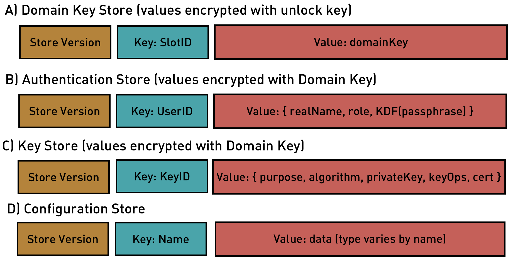
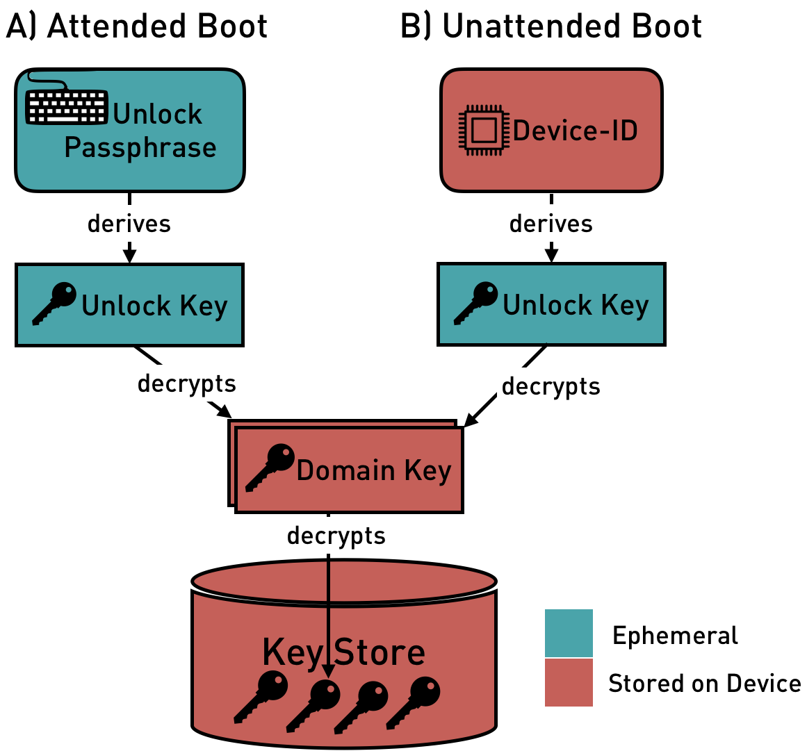
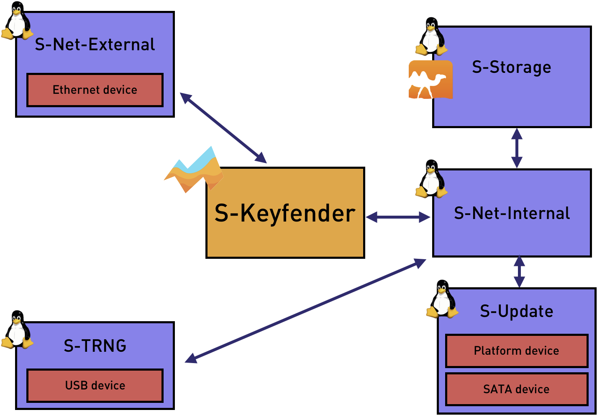

% NitroHSM System Design
% Hannes Mehnert; Martin Lucina; Stefanie Schirmer
% Robur.io, 5th December 2018
# Introduction

Nitrokey UG (client) wants to develop an innovative Hardware Security Module (HSM). This should be able to securely store a large number of cryptographic keys, have a high computing performance and offer common key management functions. The NitroHSM comes as a server and offers a REST-based API for consumers.

This document describes the System Design and Technical Architecture of the NitroHSM within the scope to be delivered by Robur, which includes:

* core functionality (business logic),
* encryption architecture and local persistent storage,
* integration with Muen Separation Kernel, including any customizations for board support and implementation of missing functionality required for the system,
* development of a custom "Linux distribution" for Linux-based Subjects,
* integration with platform _Firmware_ ("stock" BIOS or Coreboot),
* secure software updates.

A separate document describes the REST-based API for consumers, which will also be delivered by Robur. The actual user interface ("Web UI") is out of scope and will be developed by a separate team.

The [Muen Separation Kernel][muen] is an open source microkernel that has been formally proven to contain no runtime errors at the source code level. Muen runs on the Intel x86-64 architecture, and uses the VT-x and VT-d features to provide isolation for multiple subjects. Muen-based systems are entirely static and configured only at build time.

We use Muen as the lowest layer, i.e. operating system that runs on the NitroHSM hardware.

[MirageOS][mirage] is a library operating system that constructs unikernels for secure applications. Applications can be developed on a normal OS such as Linux or MacOS and then retargetted to run as a unikernel on Muen without any modifications to the source code.

[muen]: https://muen.sk/
[mirage]: https://mirage.io/

# Terminology and Conventions

Authentication Store

: A data store containing encrypted user credentials (login, passphrase) and mapping to permissions/roles.

Backup Key

: A symmetric key used for outer layer encryption of system backups. Derived from the _Backup Passphrase_ once configured, and stored in the _Configuration Store_.

Backup Passphrase

: The _Backup Passphrase_ is required to gain access to a system backup.

Configuration Store

: An unencrypted data store containing system configuration, including: network configuration, TLS endpoint configuration (certificates and private key), logging and metrics configuration.

Device ID

: A persistent device-dependent identifier, unique to each NitroHSM hardware unit delivered by Nitrokey. The Device ID is used to derive an _Unlock Key_, if and only if unattended boot is configured.

Domain Key

: A key used to encrypt data in the _Authentication Store_ and _Key Store_.

Domain Key Store

: A data store containing encrypted _Domain Keys_.

Extension

: An optional feature not part of the Minimum Viable Product. Extensions are referred to as **Ext-Name** throughout this document.

Firmware

: The platform firmware (a.k.a. "BIOS") used by the NitroHSM hardware.

Key Store

: A data store containing encrypted assets (keys).

Locked

: A _Provisioned_ NitroHSM initially boots up in a _Locked_ state, with no access to the encrypted _Authentication Store_ or _Key Store_. See [Encryption Architecture] for details of how a _Locked_ NitroHSM can transition into an _Operational_ state.

Operational

: An _Operational_ NitroHSM is ready to process requests, and all functionality is available. This implies that in this state the system is neither _Locked_ nor _Unprovisioned_.

Provisioned

: The opposite of _Unprovisioned_.

Role

: Each user account configured on the NitroHSM has a single _Role_ assigned to it.  Roles are referred to as **R-Name** throughout this document; see [Roles] for a detailed list.

System Software

: The NitroHSM system software, i.e. Muen and all subjects.

Unlock Key

: An _Unlock Key_ is an ephermeral key required to decrypt the _Domain Key_, gaining access to the encrypted _Authentication Store_ and _Key Store_.

Unlock Passphrase

: The _Unlock Passphrase_ is used to derive an _Unlock Key_ and must be provided by the user at boot time, unless unattended boot has been configured.

Unprovisioned

: An _Unprovisioned_ NitroHSM has not been configured by the user and does not contain any _User Data_, i.e. all data stores are empty or non-existent. This implies that only the limited subset of functionality needed for [Initial Provisioning] is available.

User Data

: Used collectively to refer to all user data persistently stored on the NitroHSM, i.e. the _Domain Key Store_, _Configuration Store_, _Authentication Store_ and _Key Store_. See [Data Model] for details.

# User Stories

The user stories in this section are described from the point of view of a user interacting with a web-based user interface to the NitroHSM. While development of this user interface is not part of the project scope as defined in this document, we use this presentation in order to understand the functional requirements and operations to be provided by the REST-based API.

Unless otherwise stated, an implicit pre-condition for all user stories is a NitroHSM in the _Operational_ state.

Note that this list of user stories is not exhaustive. We have included those user stories that have a direct relationship to those parts of the System Design that are in the scope to be delivered by Robur. We expect that other parties developing e.g. a "Web UI" or other REST API consumers will need to develop more user stories as part of their development process.

## Initial Provisioning

Pre-conditions: An _Unprovisioned_ NitroHSM, with its Ethernet port _directly_ connected to the secure client computer to be used for Initial Provisioning.

1. Power on the NitroHSM.
2. The NitroHSM will boot up with a static IP address of `192.168.1.1` and will generate a new self-signed TLS certificate and private key.
3. On the secure client computer, browse to `https://192.168.1.1/`.
4. Add a security exception for the NitroHSM's self-signed TLS certificate.
5. The system will prompt you to set the "wall clock" time (see [Timekeeping]).
6. The system will prompt you to either:

     a. Set an _Unlock Passphrase_.
     b. Set a passphrase for an initial **R-Administrator** user account, by convention named `admin`.
     c. The NitroHSM is now in an _Operational_ state.
7. Or:

     a. Restore from an existing backup. You will need to provide the _Backup Passphrase_.
     b. The NitroHSM will restore all _User Data_ and reboot.
     c. Depending on the restored configuration and hardware unit, the NitroHSM now continues with either [Attended Boot] or [Unattended Boot]. Refer to [Encryption Architecture] and [Backup and Restore] for details.

**Notes:**

After step 6c, the user is expected to continue with configuration of the NitroHSM, primarily by configuring the TLS endpoint by generating a CSR on the NitroHSM and submitting the result to a certification authority.

In step 7a, the system will restore all _User Data_. This may result in the IP address and TLS certificate changing on next boot. Refer to [Backup and Restore] for details.

## Attended Boot

Pre-conditions: A _Provisioned_ NitroHSM, connected to your infrastructure network.

1. Power on.
2. The NitroHSM boots up into the _Locked_ state. To unlock it, perform the following steps:

     a. Browse to `https://(NitroHSM hostname)/`.
     b. Enter the _Unlock Passphrase_.
3. The NitroHSM is now in an _Operational_ state.

**Notes:**

No other operations are possible when the NitroHSM is in the _Locked_ state.

## Unattended Boot

Pre-conditions: A _Provisioned_ NitroHSM, connected to your infrastructure network, with unattended boot enabled.

1. Power on.
2. The NitroHSM boots up into the _Locked_ state.
3. The NitroHSM will automatically transition into an _Operational_ state with no user intervention.

**Notes:**

Refer to [Encryption Architecture] for implementation details of unattended boot.

## Enabling Unattended Boot

Pre-conditions: A _Provisioned_ NitroHSM, connected to your infrastructure network.

1. Browse to the NitroHSM and log in as an **R-Administrator** account.
2. Navigate to "configure unattended boot" and enable the option.
3. On next boot, the NitroHSM will behave as described in [Unattended Boot].

**Notes:**

Refer to [Encryption Architecture] for implementation details of unattended boot.

## Disabling Unattended Boot

Pre-conditions: A _Provisioned_ NitroHSM, connected to your infrastructure network, with unattended boot enabled.

1. Browse to the NitroHSM and log in as an **R-Administrator** account.
2. Navigate to "configure unattended boot" and disable the option.
3. On next boot, the NitroHSM will behave as described in [Attended Boot].

**Notes:**

Refer to [Encryption Architecture] for implementation details of unattended boot.

## System Software Update

Pre-conditions: A _Provisioned_ NitroHSM, connected to your infrastructure network.

1. Browse to the NitroHSM and log in as an **R-Administrator** account.
2. Upload a _System Software_ image to the NitroHSM.
3. The NitroHSM verifies image authenticity, integrity, and version number.
4. Optionally, the NitroHSM displays release notes, if any.
5. Confirm the update operation ("commit").
6. The NitroHSM will reboot into the new _System Software_.

**Notes:**

Any data migration is only perfomed _after_ the NitroHSM has successfully booted the new _System Software_ version.

If the NitroHSM is powered down before the "commit" operation, the user will have to re-apply the update.

## System Backup

Pre-conditions: A _Provisioned_ NitroHSM, connected to your infrastructure network. The _Backup Passphrase_ is configured.

1. Browse to the NitroHSM and log in as an **R-Administrator** or **R-Backup** account.
2. Navigate to "Backup".
3. Download the encrypted backup.

**Notes:**

The backup is encrypted with the _Backup Key_, derived from the _Backup Passphrase_ when configured. Refer to [Backup and Restore] for details.

## System Restore

System restore is only possible in an _Unprovisioned_ state. Refer to [Reset to Factory Defaults] and [Initial Provisioning].

## Reset to Factory Defaults

### Administrative Reset

Pre-conditions: A _Provisioned_ NitroHSM, connected to your infrastructure network.

1. Browse to the NitroHSM and log in as an **R-Administrator** account.
2. Navigate to "Reset to Factory Defaults".
3. Confirm the operation.
4. The NitroHSM securely erases all _User Data_.
5. The NitroHSM reboots.
6. The NitroHSM boots up in an _Unprovisioned_ state; see [Initial Provisioning].

### Physical Reset (Recovery)

Pre-conditions: Physical access to a _Provisioned_ NitroHSM.

1. If the NitroHSM is powered on, power it off,
2. While powering on the NitroHSM, hold down the "Reset Button" for at least 10 seconds.
3. The NitroHSM securely erases all _User Data_.
4. The NitroHSM reboots.
5. The NitroHSM boots up in an _Unprovisioned_ state; see [Initial Provisioning].

**Notes:**

As an alternative to a physical "Reset Button", we may require the user to plug in a keyboard and hold down e.g. `F2` while the NitroHSM is booting. The final technology depends on the choice of hardware by Nitrokey.

# Detailed Description

## Data Model

{width=75%}

All _User Data_ is stored in a number of persistent data stores on the NitroHSM; see Figure 1: Data Model. Each data store is a Key/Value store, additionally containing a version number (denoted as "Store Version" in the diagram).  This version number is incremented whenever the underlying data model ("Values") of a data store changes. It determines if data migration code needs to be run for that data store.

For each data store, the diagram shows, as a high-level overview, which types of "Keys" are associated with which types of "Values". See the REST API documentation for a detailed definition of the data types, including:

* valid input and output data types for each HTTPS endpoint, which correspond to the "Values" stored in each data store,
* constraints for each data type, e.g. "a KeyID needs to be a string of alphanumeric characters, which is between 1 and 128 characters long".

## Roles

Each user account configured on the NitroHSM has _one_ of the following _Roles_ assigned to it. Following is a high-level description of the operations allowed by individual _Roles_, for endpoint-specific details please refer to the REST API documentation.

R-Administrator

: A user account with this _Role_ has access to all operations provided by the REST API, with the exception of "key usage" operations, i.e. message signing and decryption.

R-Operator

: A user account with this _Role_ has access to all "key usage" operations, a read-only subset of "key management" operations and "user management" operations allowing changes to their own account only.

R-Metrics

: A user account with this _Role_ has access to read-only metrics operations only.

R-Backup

: A user account with this _Role_ has access to the operations required to initiate a system backup only.

## Encryption Architecture

{width=75%}

The _Authentication Store_ and _Key Store_ are persisted to disk, but their values are encrypted and authenticated using the so-called _Domain Key_. Only the **S-Keyfender** subject has decrypted access to these stores. The _Domain Key_ is stored in the _Domain Key Store_, and encrypted using AES128-GCM (i.e. AEAD) with ephemeral _Unlock Keys_.

The _Domain Key Store_ contains two "Slots" for encrypted _Domain Keys_; which "Slot" is used depends on whether or not the NitroHSM is configured for [Unattended Boot]. Specifically, a _Provisioned_ NitroHSM (via **S-Keyfender**) performs the following steps during boot to transition from the initial _Locked_ state into an _Operational_ state:

|     _State_ = _Locked_
|     _Unlock Key_ = KDF(_Device ID_)
|     _Domain Key_ = Decrypt\_AES128GCM(_Unlock Key_, _Slot 1_)
|     IF decryption was successful:
|         GOTO UNLOCKED
|     ELSE LOOP:
|         _Unlock Passphrase_ = Await API call to `/unlock` endpoint
|         _Unlock Key_ = KDF(_Unlock Passphrase_)
|         _Domain Key_ = Decrypt\_AES128GCM(_Unlock Key_, _Slot 0_)
|         IF decryption was successful:
|             Return _Success_ to API caller
|             GOTO UNLOCKED
|         ELSE:
|             Return _Failure_ to API caller
| 
|     UNLOCKED:
|     _State_ = _Operational_

During [Unattended Boot], (see Figure 2: Encryption Architecture, right hand side), a unique _Device ID_ is used to derive the _Unlock Key_, which is then used to decrypt the encrypted _Domain Key_ stored in "Slot 1". If the decryption step fails (for example, due to _User Data_ having been restored from a backup created on a different hardware unit), the NitroHSM shall automatically fall back to [Attended Boot].

During [Attended Boot], (see Figure 2: Encryption Architecture, left hand side), the NitroHSM waits for the user (via the `/unlock` endpoint of the REST API) to provide an _Unlock Passphrase_. This is used to derive the _Unlock Key_, which is then similarly used to decrupt the encrypted _Domain Key_ stored in "Slot 0". If the decryption step fails (due to the user providing an incorrect _Unlock Passphrase_), the NitroHSM shall remain in the _Locked_ state, and continue to await an _Unlock Passphrase_.

For the avoidance of doubt: The act of [Enabling Unattended Boot] causes **S-Keyfender** to compute an _Unlock Key_ dervied from the _Device ID_ and populate "Slot 1" with a _Domain Key_ encrypted with this _Unlock Key_. Conversely, [Disabling Unattended Boot] causes **S-Keyfender** to erase (overwrite) the contents of "Slot 1". At no point does the NitroHSM persistently store either the _Unlock Passphrase_ or an _Unlock Key_.

## Technical Architecture

{width=75%}

NitroHSM consists of five Muen subjects, as shown in Figure 3: Muen Subjects. Bidirectional communication channels are drawn as arrows.

The **S-Net-External** subject is a minimized Linux which bridges ethernet frames between the physical Ethernet device, which is passed to this subject, and the virtual network interface connected to **S-Keyfender**.  Apart from the Ethernet device driver only a minimal amount of Linux "userland" needs to be present in **S-Net-External**, e.g. `brctl` and `ip`, to enable bridging between the two interfaces. Specifically, there is no need for a configured IP address for this subject.

The **S-TRNG** subject is a minimized Linux which provides external entropy to **S-Keyfender**. It utilizes the TRNG of a SmartCard, connected via USB, to periodically send datagrams to **S-Keyfender** containing output of the TRNG. The physical USB controller is passed to this subject.

The **S-Storage** subject is a minimized Linux which provides persistence to **S-Keyfender** via the `git` protocol, storing the repository on virtualized block storage provided by **S-Platform**.

The **S-Platform** subject is a minimized Linux which manages _System Software_ updates of NitroHSM, and provides block storage for **S-Storage**. The physical disk device (i.e. SATA controller) is passed to  this subject. The **S-Platform** subject also manages the hardware platform, and provides services to update the _System Software_, securely erase all _User Data_, read the _Device ID_, and shutdown and reboot the device.

The **S-Keyfender** subject is a MirageOS Unikernel which provides a HTTPS endpoint for the REST API that handles requests directly or by delegating it to a different subject. **S-Keyfender** is the only subject with decrypted access to the _Authentication Store_ and _Key Store_. This is the only subject exposed to the public network.

**Note**: Currently **S-TRNG** is not implemented. Also, **S-Storage** and **S-Platform** are combined in a single subject **S-Kitchen-Sink**.

### Keyfender

**S-Keyfender** is the core subject of NitroHSM, implemented entirely in OCaml as a MirageOS unikernel. It provides a HTTPS endpoint, serving the REST API providing the core NitroHSM functionality to consumers. We expect that there will initially be two consumers of the REST API:

1. A "Web UI", to be implemented by a separate team as a client-side Javascript application,
2. A PKCS#11 driver, also to be implemented by a separate team.

Additional functionality provided by **S-Keyfender**:

* hosting of static HTML, Javascript and other assets required by the "Web UI",
* logging of system events to a remote syslog host (as defined by [RFC 3164]),
* an API endpoint for retrieving metrics (e.g. network traffic, memory usage, store usage, key operations, uptime).

For the avoidance of doubt, the following functionality is specifically _not_ provided by **S-Keyfender**:

* A DNS resolver or DHCP client. This implies that a NitroHSM can only be configured to use a static IPv4 address, and that any external services (such as syslog) can likewise only be configured using an IPv4 address.

[RFC 3164]: https://tools.ietf.org/html/rfc3164

#### Rate limiting

To limit brute-forcing of passphrases, **S-Keyfender** rate limits logins. The rate for the unlock passphrase is enforced globally (at the moment at most 10 accesses per second). The rate limit for all endpoints requiring authentication is 10 per second per IP address.

#### Timekeeping

In order to provide core system functionality, including but not limited to:

1. Correct responses in HTTP headers (e.g. `Last-Modified`, `Expires`, `Date`).
2. Meaningful timestamps in log messages.

**S-Keyfender** requires access to "wall clock" time. Muen systems have a built-in time subject which has exclusive access to the RTC and provides system-wide "wall clock" time to all subjects. However, there is currently no support in Muen for _setting_ the system-wide "wall clock" and persisting it to the RTC.

Therefore, as a minimum, we will implement a REST endpoint to allow an **R-Administrator** to set the "wall clock" time as seen by **S-Keyfender**. **S-Keyfender** will persist the offset between the RTC and "wall clock" time to the _Configuration Store_, allowing **S-Keyfender** to maintain "wall clock" time across reboots. This implies that, in the mean time, other subjects such as **S-Storage**, **S-Platform** and **S-TRNG** will _not_ share the same view of "wall clock" time as **S-Keyfender**.

**Note**: There will be no support for timezones; any time values used in REST API endpoints will use Coordinated Universal Time (UTC) only, i.e. an [RFC 3339] `time-offset` of `Z`. It is the responsibility of the client (e.g. "Web UI") to translate to local time, if this is desired.

[RFC 3339]: https://tool.ietf.org/html/rfc3339

#### Backup and Restore

Every backup is encrypted with a _Backup Key_, which is computed from the _Backup Passphrase_ using a key derivation function. When a _Backup Passphrase_ is configured or changed by an **R-Administrator**, the resulting _Backup Key_ is stored in the unencrypted _Configuration Store_. The backup HTTPS endpoint is only enabled after the _Backup Passphrase_ has been configured by an **R-Administrator** and a _Backup Key_ exists.

The backup is double-encrypted: the outer encryption layer uses the _Backup Key_, the data contained is the unencrypted _Configuration Store_ and the _Authentication Store_, _Domain Key Store_ and _Key Store_, all of which are encrypted with the _Domain Key_ as an inner encryption layer.

This implies that:

1. To gain access to all data contained in a backup (notably the encrypted contents of the _Authentication Store_ and _Key Store_), _both_ the _Backup Key_ and an _Unlock Key_ are required.
2. Storing the _Backup Key_ in the unencrypted _Configuration Store_ is not a security risk (does not change the threat model), as the only data additionally protected by the _Backup Key_ is that contained in the same unencrypted _Configuration Store_. An attacker that has physical access to the NitroHSM can already gain access to this data.

The backup mechanism is designed this way to support automated backups: Once the _Backup Passphrase_ has been configured by an **R-Administrator**, an external client can periodically fetch the backup endpoint and store the data persistently. This backup client only requires credentials for an **R-Backup** user account, and is _not_ able to decrypt the backup, neither the outer nor the inner layer.

When a backup is initiated, **S-Keyfender** prepares a backup, encrypts it with the stored _Backup Key_ and sends it to the requesting client.

During system restore, the backup is decrypted by **S-Keyfender** using an ephemeral _Backup Key_ computed from the _Backup Passphrase_ provided by the user and, if the decryption is sucessful, all _User Data_ is restored. In order to be able to operate on the restored data, the NitroHSM also requires an _Unlock Key_. In practice this means that either the corresponding _Unlock Passphrase_ current at the time of the backup must be known to the person restoring the backup, or the backup must have been restored on the same hardware unit as that which created it, and [Unattended Boot] must have been enabled. For details refer to [Encryption Architecture].

**Note**: For the avoidance of doubt, partial backup and restore are _not_ provided. This implies that restoring a backup may change the network and TLS endpoint configuration of the NitroHSM, and also the _Unlock Passphrase_, to those current at the time of the backup.

Backup by **S-Keyfender** serializing (but _not_ decrypting) the contents of each data store (i.e. _User Data_) into a JSON format, and encrypting the result with the _Backup Key_. This will only backup a snapshot of each data store without history. During system restore, the reverse process is performed; the contents of each data store are de-serialized from the JSON format and inserted into the store.

#### Further Extensions

**Ext-MultiCore**: **S-Keyfender** could be split up into two subjects: **S-Keyfender**, and **S-Crypto-Worker**. **S-Keyfender** would then delegate all operations on private key material (key generation, decryption, signing) to **S-Crypto-Worker**. This could be implemented using a simple "request queue", with load-balancing to multiple instances of **S-Crypto-Worker** running on multiple CPU cores. Depending on the protocol used for such delegation requests (private key in-band or not), **S-Crypto-Worker** _may_ require access to **S-Storage**. Apart from providing the ability to scale up to multiple CPU cores for performance, this would also allow **S-Keyfender** to continue to serve HTTPS requests while a long-running cryptographic operation (e.g. key generation) is in progress.

**Ext-ECC**: If support for ECC is implemented as part of the OCaml-TLS project effort to support TLS 1.3, we will extend **S-Keyfender** with support for ECC. (~5 days for integration and testing)

**Ext-SmartCard**: As currently designed, the private key used by **S-Keyfender** for the TLS endpoint is stored unencrypted in the _Configuration Store_. This is unavoidable as otherwise there would be no way for a NitroHSM to provide a TLS endpoint. We could instead store this private key on the smartcard available to **S-TRNG**. This would make it impossible to extract the private key from a running NitroHSM remotely; however, an attacker with physical access could still steal the smartcard. This would require both a more complex, bi-directional, communication protocol between **S-Keyfender** and **S-TRNG** and much more of a software stack (at least all of `opensc`, `pcscd` and a [PKCS#11 proxy][caml-crush]) running inside **S-TRNG**.

[caml-crush]: https://github.com/caml-pkcs11/caml-crush

**Ext-Syslog-TLS**: Implement full syslog support as described in [RFC 5424], with support for a TLS-based transport as described in [RFC 5425]. Requires **Ext-Time** for server TLS certificate validation.

[RFC 5424]: https://tools.ietf.org/html/rfc5424
[RFC 5425]: https://tools.ietf.org/html/rfc5425

**Ext-Time**: An alternative approach which does not require persisting current "wall clock" time in **S-Keyfender** or to the RTC would be to implement a unicast SNTP client as described in [RFC 4330] and its associated configuration endpoint (IP address).

[RFC 4330]: https://tools.ietf.org/html/rfc4330

### Linux-based Subjects

All Linux-based Muen subjects that are integrated in the system will be built on a common base. We use the terms "Linux distribution" and/or "minimized Linux" to refer to this base, which is a collection of:

- An LTS release of the Linux kernel, with Muen patches and a _minimal_, _hardened_, configuration applied. The specific kernel version will be selected at the time that development of the Linux distribution begins, to be based on the most-recent LTS release available (or known to be upcoming) from [kernel.org][kernelorg].
- A custom, _minimal_, componentized "userland" and associated tooling (build system). The Muen developers are currently using a [Buildroot][buildroot]-based setup for this; we will also consider [LinuxKit][linuxkit] as it allows for building a distribution with an even smaller "userland" and incorporates other modern features allowing for further hardening of the system.

[kernelorg]: https://kernel.org/
[buildroot]: https://buildroot.org/
[linuxkit]: https://github.com/linuxkit/linuxkit

### System Software Update

The _System Software_ is a binary image, signed and distributed by Nitrokey. The versioning schema is *major*.*minor*. In each *major* release series, upgrades and downgrades within the same *major* release are allowed ("eligible" below). The data layout will not change within a *major* release series, but may change between release *major*.x and *major*+1.y. Downgrades to an older *major* release are not allowed.

Updates must be applied manually by the user; "OTA" updates are not in scope.

The act of updating the _System Software_ is performed by **S-Platform**; when **S-Keyfender** is processing an update file from the REST API, the following actions happen in parallel:

- **S-Keyfender** performs any decompression required and streams the binary image to **S-Platform**, which writes it to an _inactive_ system partition.
- at the same time, **S-Keyfender** verifies the "outer signature" (protecting the integrity of the binary image, version number, release notes) and update eligibility.

_If and only if_ verification of the _System Software_'s "outer signature" and update eligibility are successful, **S-Keyfender** enables the REST API endpoint allowing the user to "commit" the software update. Only after this endpoint is requested will **S-Keyfender** instruct **S-Platform** to perform the actions necessary (e.g. modifying the GPT or interacting with the _Firmware_) to boot from the new system partition _once_ on next boot.

During boot, the _System Software_'s "inner signature" is verified by the _Firmware_ as part of Trusted Boot. If the new _System Software_ does not boot successfully or the Trusted Boot verification fails, the system will automatically reboot into the old _System Software_ as a fallback.

_If and only if_ both Trusted Boot verification succeeds and the new _System Software_ boots sucessfully, the new _System Software_ will perform the actions necessary to permanently configure the system to boot into the new _System Software_ (e.g. by modifying the GPT or interacting with the _Firmware_). The new _System Software_ may now start data migration, if required.

The actual implementation details of **S-Platform** will be based on the design used by both Chromium OS and CoreOS Container Linux, and are not described in more detail in this document; please refer to the Chromium OS [Disk Format][chromium-disk] and [File System/Autoupdate][chromium-autoupdate] design documents. Any deviations from this design will be documented during implementation.

[chromium-disk]: http://www.chromium.org/chromium-os/chromiumos-design-docs/disk-format
[chromium-autoupdate]: https://www.chromium.org/chromium-os/chromiumos-design-docs/filesystem-autoupdate

### Firmware Requirements

In order to implement the functionality and System Design as described thus far, the following is required from the _Firmware_:

1. GPT support is required for [System Software Update]. In the case of a "stock" BIOS, this implies UEFI.
2. Muen uses the multiboot protocol for booting. This implies the use of a bootloader such as GRUB 2. In the case of Coreboot, this must be a "payload" in the firmware and rules out the use of e.g. Linuxboot.
3. If a hardware "reset button" is used (see [Physical Reset (Recovery)]), this implies use of Coreboot or extra customization of any "stock" BIOS by the vendor.
4. Support for VT-d and correct bring-up of the IOMMU (especially in the Coreboot case), required for Muen.
5. Support for flashing a unique _Device ID_. This _may_ require customization of a "stock" BIOS.
6. If a "stock" BIOS is used, it **must** allow for provisioning of private keys used as the root of trust for Trusted Boot. Most BIOSes allow for this, but it is generally a manual operation that Nitrokey will have to perform in BIOS setup for each device separately.
7. If Coreboot is used in combination with "ME Cleaner" or similar, care must be taken by the team selecting the board and/or _Firmware_ to ensure that the system is still stable in such a configuration and all the above requirements are provided for.

**Ext-FirmwareUpdate**: The current design allows for in-band updates of the _System Software_ only. Notably, this does _not_ include updates of CPU microcode as Muen has no support for this, instead choosing to delegate this to the _Firmware_. If in-band update of platform _Firmware_ is desired, apart from the additional software (`flashrom`) required in, and attack surface (ability to write to the system flash) exposed to, **S-Platform**, the following additional requirements apply to use of a "stock" BIOS: The vendor must provide _Firmware_ images which Nitrokey can integrate into a _System Software_ image _and_ redistribute. Further, said images must be provided to Nitrokey via a secure channel, such as the [Linux Vendor Firmware Service][lvfs].

[lvfs]: https://fwupd.org/

## Security Design

NitroHSM security design is based on software with a minimal trusted computing base (TCB): the Muen Separation Kernel is used for managing the physical resources of the system and isolating the subjects from each other. Device drivers for physical devices (Ethernet, USB, Storage) are provided by minimized Linux subjects, which are accessible only from the Muen subjects. The core subject is **S-Keyfender**, a MirageOS based unikernel, developed in OCaml.

Exploitation of the subjects is possible (e.g. by exploiting the USB driver stack of the **S-TRNG** subject, or the Ethernet driver of the **S-Net-External** subject), but they do not lead to compromise of [Assets]. Only the **S-Keyfender** subject, if it is _Unlocked_, has access to the decrypted _Key Store_. The _Domain Key_ used for encrypting data in the _Key Store_ is only kept in memory, and never written unencrypted to persistent storage.

Each subject has only the minimum of privileges absolutely necessary for its operation. The TCB is kept small. It consists of the Muen Separation Kernel and **S-Keyfender**. The other subjects do not have access to the unencrypted private key material. A compromised subject (other than **S-Keyfender**) cannot access stored private key material.

Muen is implemented in Ada, a memory-safe programming language, and its isolation properties are formally verified in the Spark language. **S-Keyfender** is a MirageOS unikernel implemented in OCaml, a functional memory-safe language. MirageOS has been developed over 10 years to remove dependencies written in unsafe languages.

NitroHSM uses an append-only store for all _User Data_ (git-based). This comes with an audit trail for each data modification, which adds accountability and rollback points for the data.

#### Random numbers

The **S-Keyfender** subject uses as cryptographically secure random number generator an [implementation of][fortuna-impl] [Fortuna] with 32 pools. **S-Keyfender** does not have direct access to real hardware, it is crucial to collect non-predictable entropy.

The entropy sources used [during startup][startup-entropy] are the CPU instruction [RDRAND] (executed three times, returning 64 bit each), and once the [Whirlwind] bootstrap algorithm based on timing of instructions that take a variable number of cycles (with l=100 lmax=1024).

During normal operation, every second the output of an RDRAND execution is fed into each pool. When an event (wakeup of a sleeper, network read) is executed, a cycle counter (using RDTSC) is taken, and the lower four bytes are fed into the entropy pool. The first event cycle counter is fed into the first entropy pool, the second into the second, etc.

[Fortuna]: https://www.schneier.com/academic/fortuna/
[fortuna-impl]: https://github.com/mirage/mirage-crypto/tree/master/rng
[startup-entropy]: https://github.com/mirage/mirage-crypto/blob/master/rng/mirage/mirage_crypto_rng_mirage.ml
[RDRAND]: https://software.intel.com/content/www/us/en/develop/articles/intel-digital-random-number-generator-drng-software-implementation-guide.html
[whirlwind]: http://www.ieee-security.org/TC/SP2014/papers/Not-So-RandomNumbersinVirtualizedLinuxandtheWhirlwindRNG.pdf

### Assets

What do we want to protect?

NitroHSM runs on commodity hardware using a minimal amount of high-assurance software to protect private keys, which can be used by authenticated users via the REST API. The private keys should never leave the NitroHSM.
