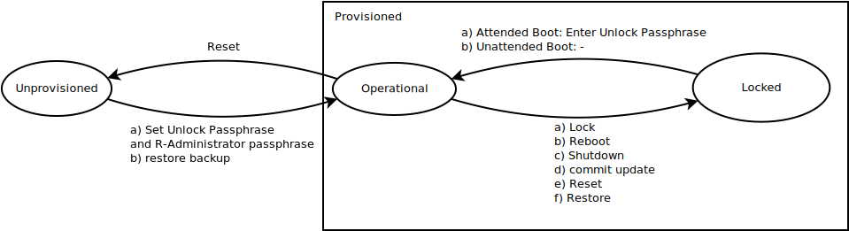
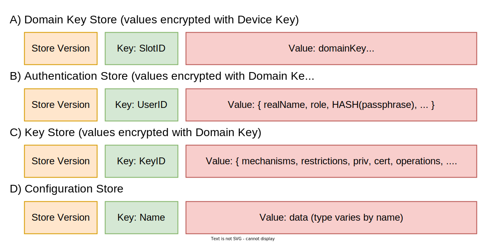
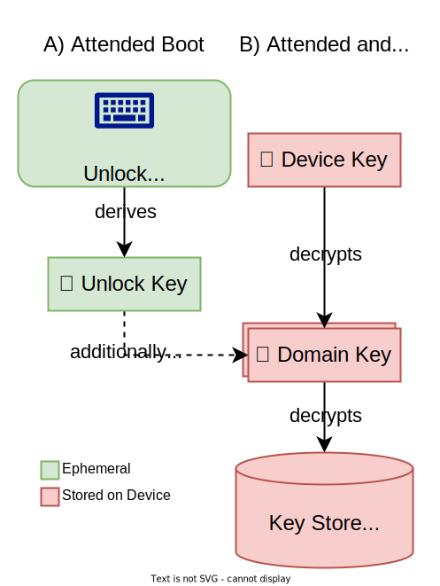
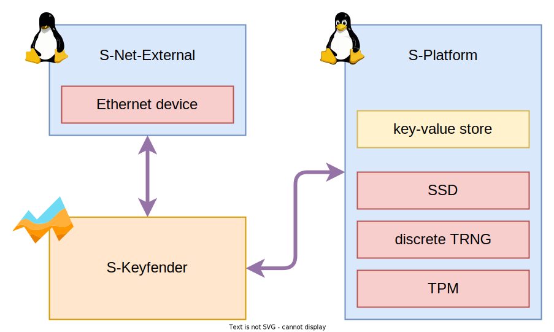
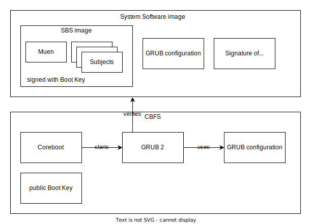

# NetHSM System Design

*Sven Anderson; Martin Lucina; Hannes Mehnert; Stefanie Schirmer; Jan Suhr*

*Nitrokey GmbH, 28.11.2023*

## Introduction

NetHSM is a networked Hardware Security Module (HSM) which can securely store a large number of cryptographic keys, has high computing performance, and offers key management functions via a modern REST-based API.

For further introductory and user guidance, see the [user documentation](https://docs.nitrokey.com/nethsm/) as a prerequisite to understand this document. This document describes the System Design and Technical Architecture of the NetHSM, which includes:

* core functionality (business logic),
* encryption architecture and local persistent storage,
* integration with Muen separation kernel, including any customizations for board support and implementation of missing functionality required for the system,
* development of a minimized Linux for Linux-based Subjects,
* integration with platform _Firmware_ (Coreboot),
* secure software updates.

A separate document describes the REST-based API for consumers.

NetHSM's hardware is in a 19" rack chassis and consists of an Intel x86 CPU, RAM, SSD, a discrete TPM, and a discrete TRNG.

The [Muen separation kernel](https://muen.sk/) is an open source microkernel that has been formally proven to contain no runtime errors at the source code level. Muen runs on the Intel x86-64 architecture, and uses the VT-x and VT-d features to provide isolation for multiple subjects. Muen-based systems are entirely static and configured only at build time.

We use Muen as the lowest layer, i.e. operating system that runs on the NetHSM hardware.

[MirageOS](https://mirage.io/) is a library operating system that constructs unikernels for secure applications. Applications can be developed on a normal OS such as Linux or macOS and then retargeted to run as a unikernel on Muen without any modifications to the source code.

## Terminology and Conventions

**Authentication Store**: A data store containing encrypted user credentials (user name, passphrase) and mapping to permissions resp. _Roles_.

**Backup Key**: A symmetric key used for outer layer encryption of backup files. Derived from the _Backup Passphrase_ once configured, and stored in the _Configuration Store_.

**Backup Passphrase**: The _Backup Passphrase_ is required to gain access to a backup file.

**Boot Mode**:The available _Boot Modes_ are _Attended Boot_ and _Unattended Boot_. See the user documentation for more information.

**Configuration Store**: An unencrypted data store containing system configuration, including: network configuration, TLS endpoint configuration (certificates and private key), logging and metrics configuration.

**Device Key**: A device-dependent key that is securely stored by the TPM and only accessible if signed and unmodified NetHSM software is running. The _Device Key_ is used to encrypt the data in the _Domain Key Store_.

**Domain Key**: A cryptographic key used to encrypt data in the _Authentication Store_ and _Key Store_.

**Domain Key Store**: A data store containing encrypted _Domain Keys_.

**Firmware**: The platform firmware (a.k.a. "BIOS", "UEFI") used by the NetHSM hardware. Refer to [System Firmware](#system-firmware) for details.

**Key Store**: A data store containing encrypted assets (keys).

**Role**: Each user account configured on the NetHSM has a single _Role_ assigned to it. _Roles_ are referred to as *R-Name* throughout this document. See the [user documentation](https://docs.nitrokey.com/nethsm/) for a detailed list.

**Subject**: An independent piece of software separated by Muen from others. _Subjects_ are referred to as *S-Name* throughout this document. See [Security Design](#security-design) for details.

**System Software**: The NetHSM _System Software_, i.e. Muen and all subjects without the _Firmware_.

**Unlock Key**: An _Unlock Key_ is an ephemeral key required to decrypt the _Domain Key_, gaining access to the encrypted _Authentication Store_ and _Key Store_.

**Unlock Passphrase**: The _Unlock Passphrase_ is used to derive an _Unlock Key_ and must be provided by the user at boot time, unless _Unattended Boot_ has been configured.

**User Data**: Used collectively to refer to all _User Data_ persistently stored on the NetHSM, i.e. the _Domain Key Store_, _Configuration Store_, _Authentication Store_ and _Key Store_. See [Data Model](#data-model) for details.

**Verified Boot**: The process used by the _Firmware_ to ensure that only _System Software_ cryptographically signed with a trusted key can be booted on the NetHSM hardware. See [Verified Boot](#verified-boot) for details.

## States

**Locked**: A _Provisioned_ NetHSM initially boots up in a _Locked_ state, with no access to the encrypted _Authentication Store_ or _Key Store_. See [Encryption Architecture](#encryption-architecture) for details of how a _Locked_ NetHSM can transition into an _Operational_ state.

**Operational**: An _Operational_ NetHSM is ready to process requests, and all functionality is available. This implies that in this state the system is neither _Locked_ nor _Unprovisioned_.

**Provisioned**: The opposite of _Unprovisioned_.

**Unprovisioned**: An _Unprovisioned_ NetHSM has not been configured by the user and does not contain any _User Data_, i.e. all data stores are empty or non-existent. This implies that only the limited subset of functionality needed for Initial Provisioning is available.

Note: Other than a NetHSM hardware appliance, resetting a NetHSM test container results in a Locked state.

## Data Model

All _User Data_ is stored in a number of persistent data stores on the NetHSM; see Figure 1: Data Model. Each data store is a key-value store, additionally containing a version number (denoted as "Store Version" in the diagram). This version number is incremented whenever the underlying data model (values) of a data store changes. It determines if data migration code needs to be run for that data store.

For each data store, the diagram shows, as a high-level overview, which types of keys (as in key-value) are associated with which types of values. See the REST API documentation for a detailed definition of the data types, including:

* valid input and output data types for each HTTPS endpoint, which correspond to the values stored in each data store,
* constraints for each data type, e.g. "a KeyID needs to be a string of alphanumeric characters, which is between 1 and 128 characters long".

## Encryption Architecture

The _Authentication Store_ and _Key Store_ are persisted to disk and their _contents_ are encrypted and authenticated using the so-called _Domain Key_. Only the subject **S-Keyfender** has decrypted access to these stores. Note that, for the avoidance of doubt, _contents_ in this context refers to only the values of each key-value store, not the keys.

The _Domain Key_ is stored in the _Domain Key Store_, and encrypted using AES256-GCM (i.e. AEAD) with the _Device Key_.

The _Domain Key Store_ contains two "slots" for encrypted _Domain Keys_; which slot is used depends on whether or not the NetHSM is configured for _Unattended Boot_. Specifically, a _Provisioned_ NetHSM (via **S-Keyfender**) performs the following steps during boot to transition from the initial _Locked_ state into an _Operational_ state:

|     _State_ = _Locked_
|     _Domain Key_ = Decrypt\_AES256GCM(_Device Key_, _Slot 1_)
|     IF decryption was successful: # In case of Unattended Boot
|         GOTO UNLOCKED
|     ELSE LOOP: # In case of Attended Boot
|         _Unlock Passphrase_ = Await API call to `/unlock` endpoint
|         _Unlock Key_ = KDF_SCRYPT(_Unlock Passphrase_)
|         _locked Domain Key_ = Decrypt\_AES256GCM(_Device Key_, _Slot 0_)
|         _Domain Key_ = Decrypt\_AES256GCM(_Unlock Key_, _locked Domain Key_)
|         IF decryption was successful:
|             Return _Success_ to API caller
|             GOTO UNLOCKED
|         ELSE:
|             Return _Failure_ to API caller
|
|     UNLOCKED:
|     _State_ = _Operational_

A random _Device Key_ (unique per device) is generated during the first boot of the system. The TPM is used to seal it with its Storage Root Key (SRK) and the PCR measurement of the _Firmware_. During subsequent boots the sealed _Device Key_ is unsealed with the TPM. This prevents access of unauthorized _Firmware_ and _Software_ to the _Device Key_.

During _Unattended Boot_, (see Figure 2: Encryption Architecture, right hand side), the _Device Key_ is used to decrypt the encrypted _Domain Key_ stored in slot 1. If the decryption step fails the NetHSM automatically falls back to _Attended Boot_.

During _Attended Boot_, (see Figure 2: Encryption Architecture, left and right hand side), the NetHSM waits for the user (via the `/unlock` endpoint of the REST API) to provide an _Unlock Passphrase_. The _Unlock Key_ is calculated by applying the key derivation function (KDF) to the _Unlock Passphrase_. The _Device Key_ is used to decrypt the encrypted _locked Domain Key_ stored in slot 0. The _Unlock Key_ is then used to decrypt the _Domain Key_ from the _locked Domain Key_. If any decryption step fails (due to the user providing an incorrect _Unlock Passphrase_ or invalid _Device Key_), the NetHSM remains in the _Locked_ state, and continues to await an _Unlock Passphrase_.

For the avoidance of doubt: The act of Enabling _Unattended Boot_ causes **S-Keyfender** to populate slot 1 with a _Domain Key_ encrypted with _only_ the _Device Key_. Conversely, Disabling _Unattended Boot_ causes **S-Keyfender** to erase (overwrite) the contents of slot 1. At no point does the NetHSM persistently store either the _Unlock Passphrase_ or an _Unlock Key_.

Among others, the described hardware binding and encryption prevents that (a copy of) the disk of one device can be decrypted in a different device.

## Technical Architecture

NetHSM consists of three Muen subjects, as shown in Figure 3: Muen Subjects. Bidirectional communication channels are drawn as arrows.

The **S-Net-External** subject is a minimized Linux which bridges Ethernet frames between the physical Ethernet device, which is passed to this subject, and the virtual network interface connected to **S-Keyfender**. Apart from the Ethernet device driver only a minimal amount of Linux "userland" needs to be present in **S-Net-External**, e.g. `brctl` and `ip`, to enable bridging between the two interfaces. Specifically, there is no need for a configured IP address for this subject.

The **S-Platform** subject is a minimized Linux which provides access to hardware components and system services. The physical disk device (SSD), the TPM and the discrete TRNG are passed to this subject. The **S-Platform** subject provides a key-value store for persistently storing all _User Data_. It provides services to update the _System Software_, securely erase all _User Data_, manage the _Device Key_ and other data from the TPM, and shutdown and reboot the device. It utilizes the discrete TRNG to create external entropy and periodically sends datagrams to **S-Keyfender** containing output of the discrete TRNG.

The **S-Keyfender** subject is a MirageOS unikernel which provides a HTTPS endpoint for the REST API that handles requests directly or by delegating it to a different subject. **S-Keyfender** is the only subject with decrypted access to the _Authentication Store_ and _Key Store_. This is the only subject exposed to the public network.

### S-Keyfender

**S-Keyfender** is the core subject of NetHSM, implemented entirely in OCaml as a MirageOS unikernel. It provides a HTTPS endpoint, serving the REST API providing the core NetHSM functionality to consumers.

Additional functionality provided by **S-Keyfender**:

* logging of system events to a remote syslog host (as defined by [RFC 3164](https://tools.ietf.org/html/rfc3164)),
* an API endpoint for retrieving metrics (e.g. network traffic, memory usage, storage usage, key operations, uptime).

For the avoidance of doubt, a DNS resolver or DHCP client is specifically _not_ provided by **S-Keyfender**. This implies that a NetHSM can only be configured to use a static IPv4 address, and that any external services (such as syslog) need to be configured with an IPv4 address too.

### Timekeeping

In order to provide core system functionality, including but not limited to:

1. Correct responses in HTTP headers (e.g. `Last-Modified`, `Expires`, `Date`)
2. Meaningful timestamps in log messages

**S-Keyfender** requires access to "wall clock" time. Muen systems have a built-in time subject which has exclusive access to the RTC and provides system-wide "wall clock" time to all subjects. However, there is currently no support in Muen for _setting_ the system-wide "wall clock" and persisting it to the RTC.

Therefore, a REST endpoint allows an *R-Administrator* to set the "wall clock" time as seen by *S-Keyfender*. *S-Keyfender* will persist the offset between the RTC and "wall clock" time to the _Configuration Store_, allowing *S-Keyfender* to maintain "wall clock" time across reboots. This implies that, in the mean time, other subjects such as *S-Platform* will _not_ share the same view of "wall clock" time as *S-Keyfender*.

Additionally there might be the possibility to set the system RTC from outside, for example from the BMC, depending on the hardware platform. In this case the offset can be left at 0 by not providing any "wall clock" time.

**Note**: There will be no support for timezones. Any time values used in REST API endpoints will use Coordinated Universal Time (UTC) only, i.e. an [RFC 3339](https://tool.ietf.org/html/rfc3339) `time-offset` of `Z`. It is the responsibility of the client to translate to local time, if this is desired.

### Backup and Restore

Every backup is encrypted with a _Backup Key_, which is computed from the _Backup Passphrase_ using the key derivation function. When a _Backup Passphrase_ is configured or changed by an *R-Administrator*, the resulting _Backup Key_ is stored in the unencrypted _Configuration Store_. The backup HTTPS endpoint is only enabled after the _Backup Passphrase_ has been configured by an *R-Administrator* and a _Backup Key_ exists.

The backup is double-encrypted: The outer encryption layer uses the _Backup Key_. The data contained is the unencrypted _Configuration Store_, the _Domain Key Store_, which is encrypted with the _Device Key_, and the _Authentication Store_ and _Key Store_, which both are encrypted with the _Domain Key_ as an inner encryption layer.

In order to allow restoring the backup to another device, the _locked Domain Key_, that is the _Domain Key_ only encrypted with the _Unlock Key_ and _not_ encrypted with the _Device Key_ is additionally stored in the backup.

This implies that:

1. To gain access to all data contained in a backup (notably the encrypted contents of the _Authentication Store_ and _Key Store_), _both_ the _Backup Key_ and an _Unlock Key_ are required.
2. Storing the _Backup Key_ in the unencrypted _Configuration Store_ is not a security risk (does not change the threat model), as the only data additionally protected by the _Backup Key_ is that contained in the same unencrypted _Configuration Store_. An attacker that has physical access to the NetHSM can already gain access to this data.

The backup mechanism is designed this way to support automated backups: Once the _Backup Passphrase_ has been configured by an *R-Administrator*, an external client can periodically fetch the backup endpoint and store the backup file. This backup client only requires credentials for an *R-Backup* user account, and is _not_ able to decrypt the backup, neither the outer nor the inner layer.

When a backup is initiated, *S-Keyfender* prepares a backup, encrypts it with the stored _Backup Key_ and sends it to the requesting client.

During system restore, the backup is decrypted by *S-Keyfender* using an ephemeral _Backup Key_ computed from the _Backup Passphrase_ provided by the user and, if the decryption is successful, all _User Data_ is restored. In order to be able to operate on the restored data, the NetHSM also requires an _Unlock Key_. In practice this means that either the corresponding _Unlock Passphrase_ current at the time of the backup must be known to the person restoring the backup, or the backup must have been restored on the same hardware unit which has created it, and _Unattended Boot_ must have been enabled. Restoring a backup of a device with _Unattended Boot_ on a different device results in an _Attended Boot_ which requires the _Unlock Passphrase_. For details refer to [Encryption Architecture](#encryption-architecture).

**Note (Operational)**: When restoring from an operational state, only _Authentication Store_ and _Key Store_ are restored. Data in _Configuration Store_ and _Domain Key Store_ is ignored.

**Note (Unprovisioned)**: For the avoidance of doubt, partial restore is _not_ provided when restoring from an unprovisioned state. This implies that restoring a backup may change the network and TLS endpoint configuration of the NetHSM and also the _Unlock Passphrase_ and _Boot Mode_, to those current at the time of the backup.

When performing backups, *S-Keyfender* serializes (but _not_ decrypts) the contents of each data store (i.e. _User Data_) into a binary format, and encrypts the result with the _Backup Key_. This will only backup a snapshot of each data store without history. During system restore, the reverse process is performed; the content of each data store is de-serialized from the binary format and inserted into the store.

### Communication with S-Platform

The subject *S-Keyfender* uses a communication channel with *S-Platform* to conduct operations that need low-level platform functionality: reboot, shutdown, reset, update, and retrieving the TPM data including the _Device Key_. The protocol is line-based over a TCP stream, where *S-Platform* is listening on a socket for client connections - only a single client connection at any time is supported.

The client, after establishing the TCP stream, sends the command (all uppercase) followed by a single newline character. The server replies with either "OK" or "ERROR", optionally followed by a whitespace character and printable ASCII characters, terminated with a newline character.

Some sample sessions:

| C->S: PLATFORM-DATA\n
| S->C: OK abcdef\n

| C->S: SHUTDOWN\n
| S->C: OK\n

| C->S: FOO\n
| S->C: ERROR Unknown command\n

### Linux-based Subjects

All Linux-based Muen subjects that are integrated in the system will be built on a common base. We use the term "minimized Linux" to refer to this base, which is a collection of:

- An LTS release of the [Linux kernel](https://kernel.org/), with Muen SK [patches](https://git.codelabs.ch/?p=muen/linux.git;a=summary) and a _minimal_, _hardened_, configuration applied.
- A custom, _minimal_, componentized "userland", built with:
    - [U-Root](https://github.com/u-root/u-root), which provides Go implementations for the bulk of the "userland" and tooling to easily build "run from initramfs" based Linux systems.
    - A custom `uinit` for U-root, implemented in Go, which manages the Linux subject's lifecycle.
- The following additional "userland" software components, all of which are cross-compiled as static binaries using a musl libc [toolchain](https://musl.cc/), and only the _required_ subset of each is installed into the initramfs:
    - etcd
    - e2fsprogs (specifically, `mke2fs`)

### System Software Update

The _System Software_ is a binary image, signed and distributed by Nitrokey. The versioning schema is *major*.*minor*. In each *major* release series, upgrades and downgrades within the same *major* release are allowed ("eligible" below). The data layout will not change within a *major* release series, but may change between release *major*.x and *major*+1.y. Downgrades to an older *major* release are not possible.

Updates must be applied manually by the R-Administrator. Over the air (OTA) updates are not supported.

The act of updating the _System Software_ is performed by *S-Platform*. When *S-Keyfender* is processing an update file from the REST API, the following actions happen in parallel:

- *S-Keyfender* performs any decompression required and streams the binary image to *S-Platform*, which writes it to an _inactive_ system partition.
- at the same time, *S-Keyfender* verifies the update signature with the public _Update Key_ (protecting the integrity of the binary image, version number, release notes) and update eligibility.

_If and only if_ verification of the update signature and eligibility are successful, *S-Keyfender* enables the REST API endpoint allowing the user to "commit" the software update. Only after this endpoint is requested, *S-Keyfender* will instruct *S-Platform* to perform the actions necessary (e.g. modifying the GPT or interacting with the _Firmware_) to boot from the new system partition _once_ on next boot.

During boot, the _System Software_'s signature is verified with the public Boot Key by the _Firmware_ as part of _Verified Boot_. If the new _System Software_ does not boot successfully or the _Verified Boot_ verification fails, the system will automatically reboot into the old _System Software_ as a fallback.

_If and only if_ both _Verified Boot_ verification succeeds and the new _System Software_ boots successfully, the new _System Software_ will perform the actions necessary to permanently configure the system to boot into the new _System Software_ (e.g. by modifying the GPT or interacting with the _Firmware_). The new _System Software_ may now start data migration, if required.

The actual implementation details of *S-Platform* will be based on the design used by both Chromium OS and CoreOS Container Linux, and are not described in more detail in this document. Please refer to the Chromium OS [Disk Format](http://www.chromium.org/chromium-os/chromiumos-design-docs/disk-format) and [File System/Autoupdate](https://www.chromium.org/chromium-os/chromiumos-design-docs/filesystem-autoupdate) design documents.

### System Firmware

Coreboot is used as the _Firmware_ of the NetHSM, with GRUB 2 as the Coreboot payload (boot loader). It provides the following functionality:

1. GPT support for [System Software Update](#system-software-update)
2. Muen uses the [Signed Block Stream](https://www.codelabs.ch/download/bsbsc-spec.pdf) (SBS) protocol for _Verified Boot_. The SBS implementation from Codelabs has been integrated to GRUB 2.
3. Support for VT-d and correct bring-up of the IOMMU, required for Muen.

### Verified Boot

The process of ensuring that the NetHSM hardware will only boot _System Software_ that has been cryptographically signed is denoted as _Verified Boot_. This is implemented by a custom GRUB 2 payload for Coreboot, integrating support for [Signed Block Stream](https://www.codelabs.ch/download/bsbsc-spec.pdf) from Codelabs and modified to unconditionally enable signature verification of all loaded components.

Build-time tooling provides:

1. Embed a trusted public key (RSA-4096) into CBFS in the _Firmware_ image to be flashed to NetHSM hardware. This is considered the root of trust, and cannot be modified without reflashing the NetHSM hardware. (Note: Not to be confused with the protection of the _Device Key_ by another root of trust, namely the ACM in the chipset.)
2. Sign the components of a _System Software_ image with the matching private key (referred to as an "inner signature" in [System Software Update](#system-software-update)).
3. Build a signed "Live USB" system intended for use as an "installer" to install stock NetHSM hardware with an initial _System Software_ image.

Internally, a _System Software_ image consists of the following components:

1. The SBS image containing the Muen separation kernel, all subjects and their associated userland. This image is internally signed with the _Firmware_-trusted public key.
2. A GRUB configuration file.
3. A detached signature for the GRUB configuration file, signed with the _Firmware_-trusted public key.

These components are wrapped in a plain CPIO image, which is written to the system partition.

During system boot, Coreboot will launch the GRUB 2 payload, which will initially execute the commands defined by a trusted GRUB configuration embedded in CBFS. This configuration will attempt to "chain" into a correctly signed GRUB configuration file found in any _System Software_ image present on either the internal SSD or a USB key (for use by a Live USB installer, updater, or other component). If signature verification of the configuration file succeeds, then the system will proceed to boot from that device.

## Security Design

NetHSM runs on commodity hardware using a minimal amount of high-assurance software to protect private keys stored in the _Key Store_. A TPM is used to secure a _Device Key_, which is used to encrypt the _Domain Key_, and prevents unauthorized modifications of the _Firmware_.

NetHSM security design is based on software with a minimal trusted computing base (TCB): The Muen separation kernel is used for managing the physical resources of the system and isolating the subjects from each other. Device drivers for physical devices (Ethernet, USB, Storage) are provided by minimized Linux subjects, which are accessible only from the Muen subjects. The core subject is *S-Keyfender*, a MirageOS based unikernel, developed in OCaml.

In case a subject is exploited (e.g. by exploiting the Ethernet driver of the *S-Net-External* subject), it does not lead to a compromise of the _Key Store_ assets. Muen ensures that only the *S-Keyfender* subject, if it is _Unlocked_, has access to the decrypted _Key Store_. The _Domain Key_ used for encrypting data in the _Key Store_ is only kept in memory, and never written unencrypted to persistent storage.

Each subject has only the minimum of privileges absolutely necessary for its operation. The TCB is kept small. It consists of the Muen separation kernel and *S-Keyfender*. The other subjects do not have access to the unencrypted private key material. A compromised subject (other than *S-Keyfender*) cannot access stored private key material.

Muen is implemented in Ada, a memory-safe programming language, and its isolation properties are formally verified in the Spark language. *S-Keyfender* is a MirageOS unikernel implemented in OCaml, a functional memory-safe language. MirageOS has been developed over 10 years to remove dependencies written in unsafe languages.

NetHSM uses etcd to store all _User Data_. This comes with an log for each data modification, which adds accountability and rollback points for the data (currently not used).

### Entropy

NetHSM has the following entropy sources:

- discrete TRNG builtar by Nitrokey ([hardware](https://github.com/Nitrokey/nitrokey-trng-rs232-hardware), [firmware](https://github.com/Nitrokey/nitrokey-trng-rs232-firmware))
- TPM RNG
- Intel CPU's RDRAND
- Event loop from network and IO

Entropy is consumed in S-Platform and S-Keyfender.

#### S-Platform

S-Platform reads random data from both the discrete TRNG and the TPM and feeds them both to *S-Keyfender* and to `/dev/random` of the Linux kernel. If one of the sources fail, errors are logged.

During boot of the system *S-Keyfender* requests a _Device Key_ from *S-Platform*. At very first boot of the system a _Device Key_ doesn't exist yet. The possible generation of a new _Device Key_ is delayed until random data from both discrete TRNG and TPM has been fed to `/dev/random` at least once. The entropy used to generate the _Device Key_ is retrieved from the Go library `crypto/rand.Read()` which uses getrandom(2). If any of the two entropy sources fail, no _Device Key_ is generated, an error message is logged at the serial console, the system doesn't proceed booting and ends in an non-operational state.

#### S-Keyfender

The *S-Keyfender* subject uses as cryptographically secure random number generator, an [implementation of](https://github.com/mirage/mirage-crypto/tree/master/rng) [Fortuna](https://www.schneier.com/academic/fortuna/) with 32 pools. Because *S-Keyfender* does not have direct access to real hardware, it is crucial to collect non-predictable entropy.

The entropy sources used [during startup](https://github.com/mirage/mirage-crypto/blob/master/rng/mirage/mirage_crypto_rng_mirage.ml) are the CPU instruction [RDRAND](https://software.intel.com/content/www/us/en/develop/articles/intel-digital-random-number-generator-drng-software-implementation-guide.html) (executed three times, returning 64 bit each), and once the [Whirlwind](http://www.ieee-security.org/TC/SP2014/papers/Not-So-RandomNumbersinVirtualizedLinuxandtheWhirlwindRNG.pdf) bootstrap algorithm based on timing of instructions that take a variable number of cycles (with l=100 lmax=1024).

During normal operation, every second the output of an RDRAND execution is fed into each pool. When an event (wakeup of a sleeper, network read) is executed, a cycle counter (using RDTSC) is taken, and the lower four bytes are fed into the entropy pool. The first event cycle counter is fed into the first entropy pool, the second into the second, etc. Additionally *S-Keyfender* listens on an UDP port for packages with random data from S-Platform. These packages contain entropy from both discrete TRNG and TPM TRNG and are fed into all 32 pools.

In case during the operation either discrete TRNG or TPM RNG fails, an error message is logged repeatedly in Syslog and the system keeps running. If both of these entropy sources fail, the system stops and ends in a non-operational state.

### Asymmetric Cryptographic Implementations

The cryptography implementations are as follows:

RSA: part of the [mirage-crypto-pk](https://github.com/mirage/mirage-crypto) package, which uses the OCaml [Zarith](https://github.com/ocaml/zarith) library for big integers (backed by [gmplib](https://gmplib.org/)). Modes (PKCS/PSS) are [implemented in OCaml](https://github.com/mirage/mirage-crypto/blob/v0.10.7/pk/rsa.ml).

EC: part of the [mirage-crypto-ec](https://github.com/mirage/mirage-crypto) package, uses C code generated by [fiat-crypto](https://github.com/mit-plv/fiat-crypto/) for modular arithmetic, group operations are in OCaml and in C (from BoringSSL). The [C code](https://github.com/mirage/mirage-crypto/blob/v0.10.7/ec/native) includes YY_32.h and YY_64.h, which are generated by fiat-crypto, the files curve25519_stubs.c / curve25519_tables.h / point_operations.h are code from [BoringSSL](https://github.com/google/boringssl), the remaining C boilerplate to call out to the C function (in YY_stubs.c) are hand-written. The [OCaml code](https://github.com/mirage/mirage-crypto/blob/v0.10.7/ec/mirage_crypto_ec.ml) provides the high-level operations (ECDSA/ECDH).

### Cryptographic Parameters

The key generated for the HTTPS endpoint is an EC key (secp256r1).

The key derivation function in `keyfender/crypto.ml` is scrypt with the following chosen parameters: b=16384, r=8, p=16, salt length 16 byte

The data stored on disk is encrypted with AES256-GCM (32 byte key, nonce size is 12).

### Rate Limiting

To limit brute-forcing of passphrases, *S-Keyfender* rate limits logins. The rate for the _Unlock Passphrase_ is one failed access per second per IP address. The rate limit for all endpoints requiring authentication is 1 failed authentication per second per IP address and username.
